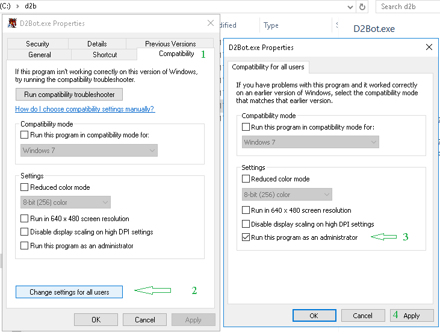

[General Table of Contents](https://github.com/blizzhackers/documentation/#diablo-2-botting-system)

[D2Bot Table of Contents](https://github.com/blizzhackers/documentation/#d2bot)

---

# Download

---

* [Requirements](#requirements)
* [Download with Github Desktop](#download-with-github-desktop)
* [Compatibility](#compatibility)
* [Keep bot files updated](#keep-bot-files-updated)

---

### Requirements
**These MUST be installed before you continue.**
* [Microsoft Visual C++ 2010 Redistributable Package (x86)](https://download.microsoft.com/download/1/6/5/165255E7-1014-4D0A-B094-B6A430A6BFFC/vcredist_x86.exe)
* [Microsoft .NET Framework 4.0 (or higher)](https://dotnet.microsoft.com/download/dotnet-framework)  (Windows 10 and newer may have this installed)

### Download with Github Desktop
* Install [Github Desktop](https://desktop.github.com/)
* Open GitHub desktop and select "file" then "clone repository" or click CTRL + SHIFT + O
* Select URL and enter the following: "https://github.com/blizzhackers/kolbot/"
* Select a local path you want to save to.  I selected "C:\Users\dom\Desktop\kolbot\kolbot"
* Click Clone and you have successfully downloaded kolbot.
   

### Keep bot files updated
The Kolbot scripting library gets regular updates.  There is no auto-updater for security reasons so it will be up to you to regularly check for updates.
* Open GitHub Desktop and it should automatically fetch any updates if there are any.
* If there are any new updates you should see a button "Pull origin" Click on that to pull all the latest updates!
  

* If you don't see anything you are fully updated.
* Other places to check for updates: https://github.com/blizzhackers/kolbot/commits/
* The blizzhackers discord development channel will also post any new updates. https://discord.gg/69W7twTm5K

### Compatibility
If you run into any issues with D2Bot.exe launching you can try running it in compatibility mode.
* Right-click D2Bot.exe and select properties.  From there click compatibility.
* For Win 8 if you get issues, try to  "Run this program in compatibility mode for Windows 7"
* Note compatibility will not fix the "D2BS is not responding error"  For that make sure you install the [Requirements](#requirements)

 

### What's Next?
[D2Bot Manager Setup](https://github.com/blizzhackers/documentation/blob/master/d2bot/ManagerSetup.md/#manager-setup)
