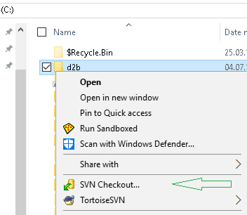
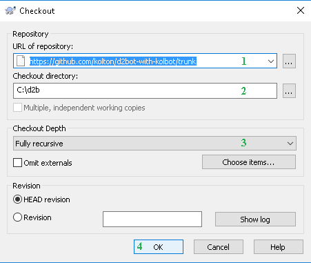
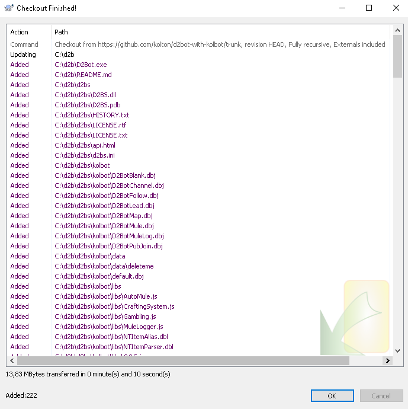
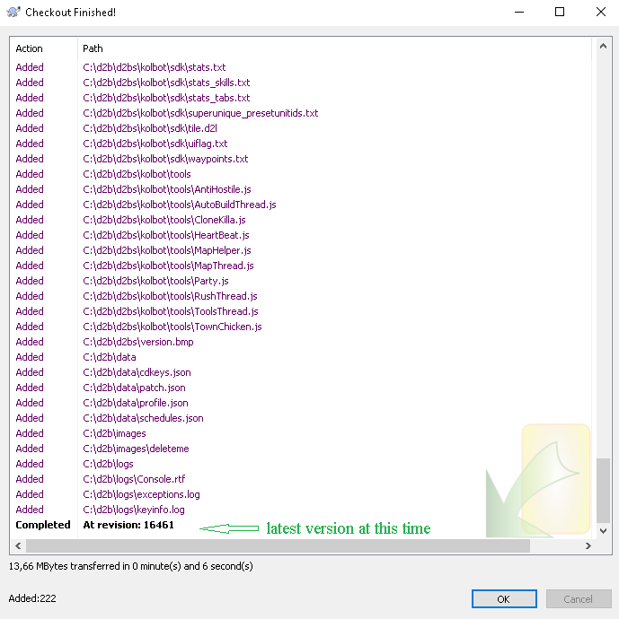
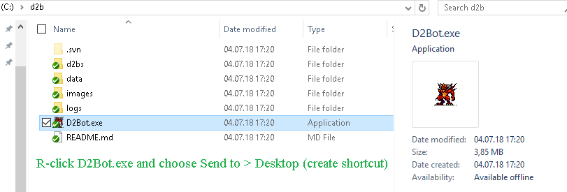

[general table of content](https://github.com/blizzhackers/documentation/#diablo-2-botting-system)

[kolbot table of content](https://github.com/blizzhackers/documentation/tree/master/d2bot/#d2bot)

---

# Download

---
* [requirements](#requirements)
* [download with tortoiseSVN](#download-with-tortoiseSVN)
* [compatibility](#compatibility)

---

### requirements
you need these to be installed:
* [Microsoft Visual C++ 2010 Redistributable Package (x86)](https://www.microsoft.com/en-us/download/details.aspx?id=5555)
* [Microsoft .NET Framework 4.0 (or higher)](https://www.microsoft.com/net/download/Windows/run)

### download with tortoiseSVN

* install [1.10.xx version of Tortoise SVN]()
* on your local hard drive, create a folder for D2BS and name it whatever you want.
* R-click that folder 
 and use SVN Checkout... 
 at <https://github.com/kolton/d2bot-with-kolbot/trunk> or if you wanna the most updated branch, the limedrop-utf8 branch use the SVN Checkout... at <https://github.com/kolton/d2bot-with-kolbot/branches/limedrop-utf8> (! use these links only for Tortoise SVN)

* let the default option for Checkout Depth drop down list = Fully recursive
* press "OK".
: finished download 1
: finished download 2
* after download is finished, open that folder and R-click D2Bot.exe and click Send to > Desktop (create shortcut) 

#### compatibility

* R-click the D2Bot.exe shortcut and choose Properties. follow the 4th steps
* 
* for Win 8 if you get issues, choose either "Run this program in compatibility mode for Windows 7"
