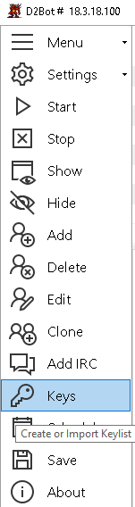
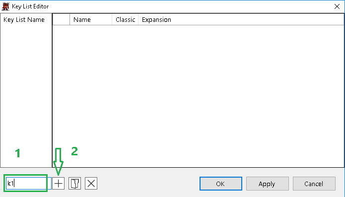
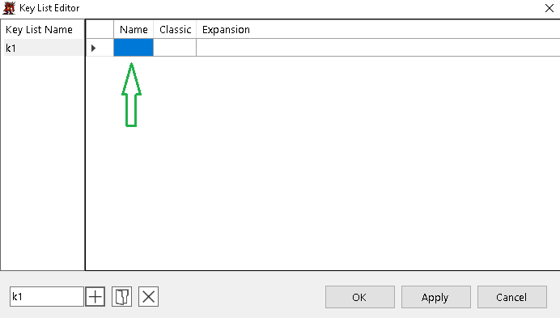
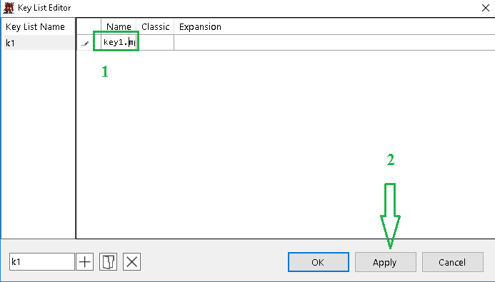
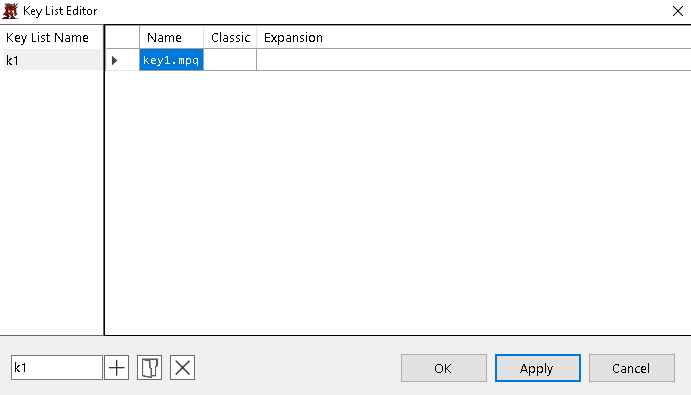
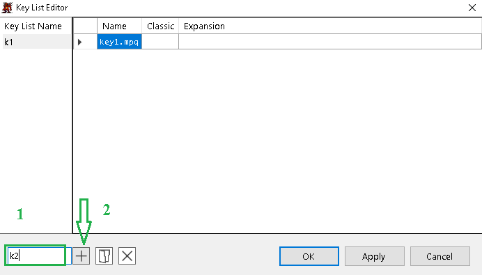
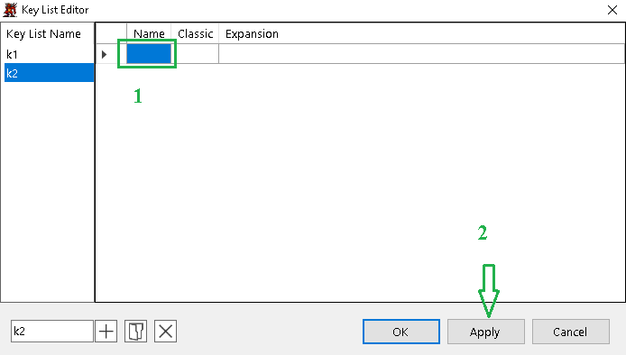

[general table of content](https://github.com/blizzhackers/documentation/#diablo-2-botting-system)

[d2bot table of content](https://github.com/blizzhackers/documentation/tree/master/d2bot/#d2bot)

---

# Keylist

---

* [info](#info)
* [keylist creation](#keylist-creation)
* [manual edit](#manual-edit)
	* [adding raw/loader keys](#adding-raw-loader-keys)
	* [set keys](#set-keys)
* [using loader keys](#using-loader-keys)
	* [creating loader keys](#creating-loader-keys)
	* [creating keylist using loader keys](#creating-keylist-using-loader-keys)

---

## info
Since 14th Aug 2018 patch you cannot use the keys with 16 alphanumeric strings on battle.net, until you register and claim them on battle.net account, getting the converted 26 strings. https://us.battle.net/account/management/claim-code.html

## keylist creation


* Create a new list by typing in the text box in the bottom left corner and press the '+' button
* Type "file.mpq" in the name column to load keys from *.mpq, leave the other columns blank -- *.mpq files must be placed in the D2 folder
* Use raw cdkeys by giving it a name ex: key1, and filling out the 'Classic' and 'Expansion' columns with the keys
* Import a batch of cdkeys by clicking the folder button and choosing a [list name].csv file, a csv file can be made with excel or text editor -- Ex: File name: keys.csv, Content: key1, 123456790, 123456790 -- This adds a Key List named 'keys' (left hand side) with the key 'key1' (right hand side)

## manual edit 
You are still able to edit ...\data\cdkeys.json with notepad++.

### adding raw/loader keys
There are 2 kind of lines:
```
{"CDKeys":[{"Name":"raw1","Classic":"1234567890","Expansion":"1234567890"}],"Name":"k1"}
{"CDKeys":[{"Name":"key2.mpq","Classic":"","Expansion":""}],"Name":"k2"}
```
First line is including raw keys classic and xpac, and second line has a loader key.

1st field "Name":"xxx" is the field with name of loader key (it should be located in Diablo II botting folder), but also only the name for raw key that will be shown in manager line on key column when profile is running

2nd field "Name":"yyy" is the name of key in the list

This list will have 2 entries k1 and k2, selectable from drop-down Key List in the profile. When those profiles are running in key column you'll see "raw1", or "key2.mpq".
Your cdkeys.json file can have multiple lines like those, simply edited in np++.

### set keys
you don't need more keys to be added into a set of keys, because key switching is worthless in getting R/D (S/D) since June 2017. So one key into a keylist entry is enough.

even is not required (& recommended) after June 2017, an entry with multiple keys associated have to be something like:
```
{"CDKeys":[{key1 info}, {key2 info}, {key3 info}], "Name":"set1"}
```
case of raw d2lod keys with **set1** entry from key list with "raw1", "raw2", "raw3" sub-keys:
```
{"CDKeys":[{"Name":"raw1","Classic":"1234567890","Expansion":"1234567890"}, {"Name":"raw2","Classic":"1234567890","Expansion":"1234567890"}, {"Name":"raw3","Classic":"1234567890","Expansion":"1234567890"}],"Name":"set1"}
```

case of loader keys in a set list, **set1** including key1.mpq, key2.mpq, key3.mpq
```
{"CDKeys":[{"Name":"key1.mpq","Classic":"","Expansion":""},{"Name":"key2.mpq","Classic":"","Expansion":""},{"Name":"key3.mpq","Classic":"","Expansion":""}],"Name":"set1"}
```
## using loader keys

### creating loader keys

Since June 2017 the key switching/swapping not help you at all in battle.net counting. So it's ok to use only 1 cdkeyset/bot.

* download https://github.com/mf022/D2LoD-files/tree/master/D2LoD-key-utilities.
* read ...\loaderkey-creator\loaderkey-creator-Readme.txt.
* run ...\loaderkey-creator\keyCreator26.exe for 26 digits keys.
* create your keysets d2key.mpq (807 B) and rename them in key1.mpq, key2.mpq, ...
* choose the parent folder of Diablo II, the creator will add /Diablo II at the end of path, but you can manually edit it.
* place the loader keys into your ...\Diablo II\ folder.

### creating keylist using loader keys

follow these steps:
1. L-click Keys on the manager 



2. write the name of key set (k1), then click add \+ 



3. L-click the Name box 



4. write key1.mpq , then click Apply 



5. k1 entry with key1.mpq is done 



6. on bottom left write the name of  next key set (k2), then click add \+ 



7. L-click the Name box, write key2.mpq, then click Apply 



8. k2 entry with key2.mpq is done

