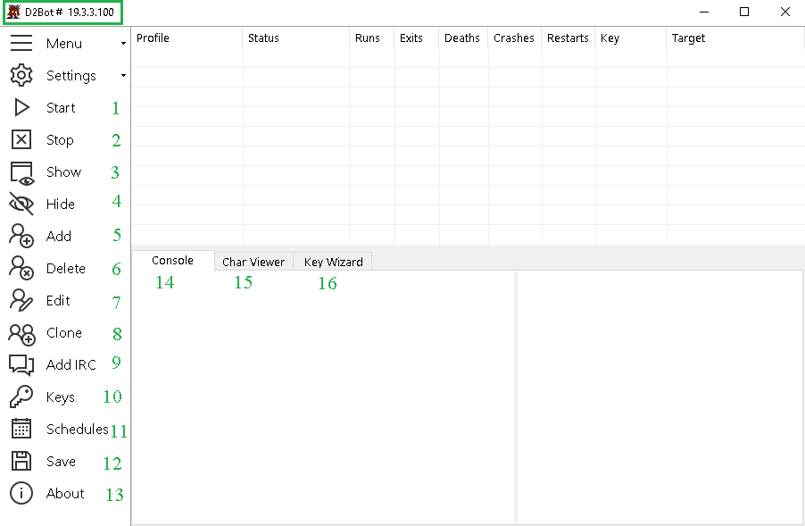
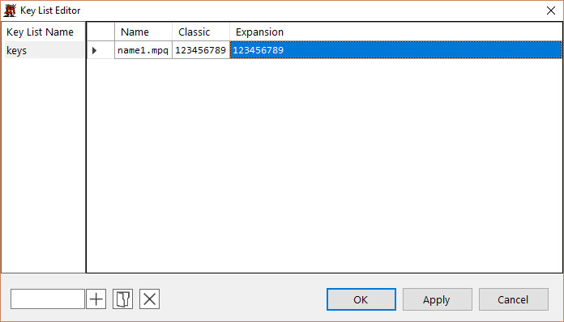
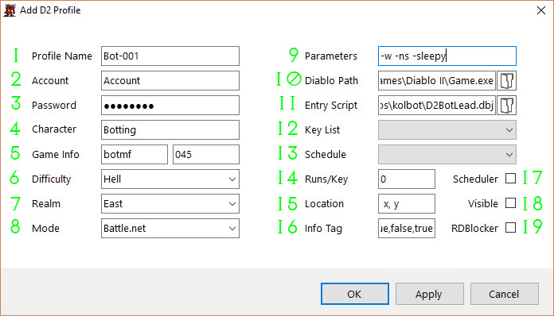
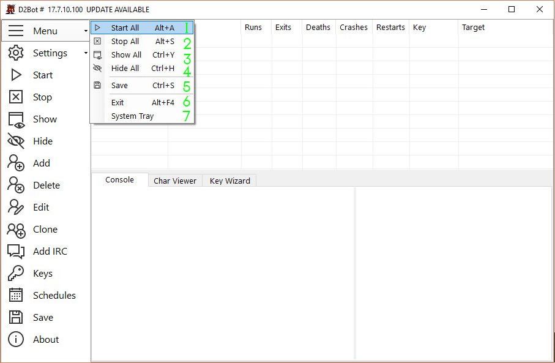
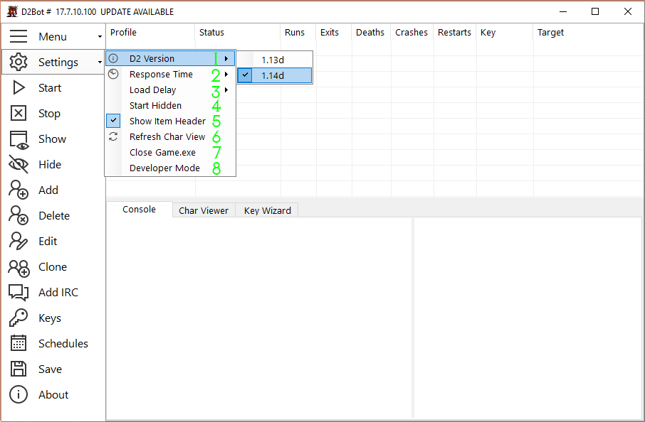
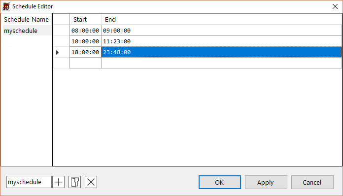

[general table of content](https://github.com/blizzhackers/documentation/#diablo-2-botting-system)

[d2bot table of content](https://github.com/blizzhackers/documentation/tree/master/d2bot/#d2bot)

---

# Manager Setup

### Install Dependencies

[Microsoft Visual C++ 2010 Redistributable Package (x86)](https://www.microsoft.com/en-us/download/details.aspx?id=5555)
[Microsoft .NET Framework 4.0 (or higher)](https://www.microsoft.com/net/download/Windows/run)

### Launch D2Bot.exe in Administrator Mode

If you use Windows 8/8.1, run D2Bot.exe in Windows 7 Compatibility Mode + Administrator Mode

 1. Start selected profile(s)
 2. Stop selected profile(s)
 3. Show selected profile(s) D2 window
 4. Hide selected profile(s) D2 window
 5. Add profile
 6. Delete profile
 7. Edit profile
 8. Clone profile
 9. Add IRC Profile (IRC Bot)
10. D2 CDKey Editor
11. Schedule Editor
12. Save current config and state
13. About cointains suport links and shows if an update is available
	

14. Console prints messages from Kolbot and shows items found
15. Char Viewer shows items located on mule accounts
16. Key Wizard shows information about keys

### Adding D2 CDKeys

* Create a new list by typing in the text box in the bottom left corner and press the '+' button
* Type [file].mpq in the name column to load keys from *.mpq, leave the other columns blank -- *.mpq files must be placed in the D2 folder
* Use raw cdkeys by giving it a name ex: key1, and filling out the 'Classic' and 'Expansion' columns with the keys
* Import a batch of cdkeys by clicking the folder button and choosing a [list name].csv file, a csv file can be made with excel or text editor -- Ex: File name: keys.csv, Content: key1, 123456790, 123456790 -- This adds a Key List named 'keys' (left hand side) with the key 'key1' (right hand side)
	
* additional info for managing [key list](https://github.com/blizzhackers/documentation/blob/master/d2bot/Keylist.md#keylist)

### Create a Profile

 1. Profile Name (use a unique name without special characters or spaces)
 2. Account (D2 account name)
 3. Password (D2 account password)
 4. Character Name (cAsE SenSiTive!)
 5. Game Name and Password (Leave password empty for public games)
 6. Difficulty
 7. Realm
 8. Mode: 

- Single player
- Battle.net
- Open Battle.net
- Host TCP/IP game
- Join TCP/IP game
		
 9. Parameters:

**-w** = windowed mode (don't change this option, it is needed for D2BS)
**-sleepy** = saves resources by inserting sleep call to game loop
**-lq** = Low Quality (low quality graphics uses less resources)
**-ns** = Disables ingame sound (uses less resources)
**-ftj** = Fail-to-join
**-L** = Loader only mode (does NOT load any scripts)

10. Path to Game.exe (or any copy of Game.exe if you use proxies)
11. Entry Point - select starter script from the kolbot folder

**D2BotBlank.dbj** - blank starter used for testing
**D2BotChannel.dbj** - using a chat channel
**D2BotFollow.dbj** - start as follower, join leader defined in character config
**D2BotGameAction.dbj** - used for limedrop
**D2BotLead.dbj** - start as leader/single mf char
**D2BotMap.dbj** - manual play with maphack enabled
**D2BotMule.dbj** - used by the mule profile
**D2BotMuleLog.dbj** - runs the mule logging script
**D2BotPubJoin.dbj** - joining public games

12. Select a cd key list previous created. (leave blank to use original key with D2 installation)
13. Select schedule (optional)
14. Set how many runs per key Recommended value is 0, do not switch keys at this time
15. Location where D2 Window will position on your screen (if Visible [18] is checked). -- ex. 0,0 = top left of desktop
16. Send custom data to scripts (optional, use if you know how to)
17. Enable selected schedule [13]
18. Launches visible D2 Window (by default it will be minimized)
19. Enables RD Block (don't enable unless you know what you are doing)

### Menu

 1. Start all profiles DON'T RUN MORE THAN WHAT YOUR PC CAN HANDLE!
 2. Stop all profiles
 3. Show all running D2 Windows
 4. Hide all running D2 Windows
 5. Save current D2Bot Manager state
 6. Exit program
 7. Hide program to tray

### Settings

 1. D2 Version - 1.14d (note that the trunk/master isn't working with 1.13d without some files from branches/1.13d) 
 2. For low resource PC or running MANY profiles, higher response time will work better but detect failures slower
 3. Sets the delay (in MS) between starting multiple profiles
 4. Start D2 Windows in hidden mode (default is minimized)
 5. Use the system font
 6. Show item header (shows account and character information in the 'Char Viewer' tab)
 7. Reloads mule files in 'Char Viewer' tab
 8. Close all instances of Game.exe (useful for rogue or crashed clients)
 9. Run API Server
10. Developer Mode (ignore, will not work if this is enabled)

### Scheduler (optional)

Allow profiles to start and stop automatically based on a designated daily schedule When the scheduler is enabled under the profile config, D2Bot will automatically start and stop the profiles if the current local time is between the 'Start Time' and 'End Time' 

* Create a new Schedule by typing in the text box in the bottom left corner and press the '+' button
* Add a timespan by typing a consecutive 'Start' and 'End' time in their respective columns (note this uses 24 hour time)
* Import a schedule by clicking the folder button and choosing a [schedule name].csv file, a csv file can be made with excel or text editor -- Ex: File name: schedule.csv, Content: 01:00, 06:00 -- This adds a Schedule named 'schedule' (left hand side) that runs between 1 AM and 6 AM
