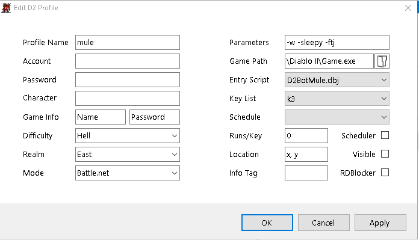

[general table of content](https://github.com/blizzhackers/documentation/#diablo-2-botting-system)

[kolbot table of content](https://github.com/blizzhackers/documentation/tree/master/kolbot/#kolbot)

---

# Automule

---

* [Step-by-step guide to muling in kolbot](#step-by-step-guide-to-muling-in-kolbot)
* [Multiple mules and multiple realm muling](#multiple-mules-and-multiple-realm-muling)
* [Torch & Anni Muling](#torch-anni-muling)

---

## Step-by-step guide to muling in kolbot

1. Open and configure MuleConfig.js found in kolbot/libs/systems/automule/config folder 

2. Open D2Bot# and click Add Profile icon

3. Input Profile Name, Diablo Path and use D2BotMule.dbj as Entry Script.

	Click OK. You're done.

Notes:

You must have at least 2 CD Keys to use kolbot AutoMule.

The mule profile is automatically started and stopped so you don't need to do that yourself.

You can test muling by running one of the enabledProfiles and pressing Numpad 5 when in a game or right-clicking on a profile and select "mule profile".

## Multiple mules and multiple realm muling

The Mules object can take multiple sub-entries which are separated by a comma.

This makes it possible to use AutoMule on multiple realms or create custom muling rules (ie. which profile will use which mule).

Example config for muling on two realms: 

The names of each sub-entry must be different ("Mule1" and "Mule2" in the example).

Different sub-entries may use the the same mule profile.

## Torch Anni Muling

TorchAnniMule is used in conjunction with a profile running OrgTorch or CloneKilla script to exclusively mule Hellfire or Annihilius unique charms.

Configuration is the same as with AutoMule, but you edit TorchMules sub-entries in AutoMule.js instead of Mules.
It can be found here: TorchAnniMules.js found in kolbot/libs/systems/automule/config folder 

## Final Notes
It is not recommended to mix torch mule accounts with regular automule accounts. They may use the same mule profile.

Continuous mule will greatly reduce the times the mule logs in reducing the chance of realm down.

