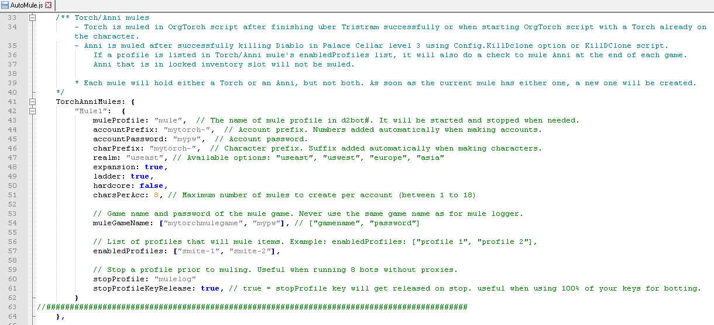

[general table of content](https://github.com/blizzhackers/documentation/#diablo-2-botting-system)

[kolbot table of content](https://github.com/blizzhackers/documentation/tree/master/kolbot/#kolbot)

---

# Automule

---

* [Step-by-step guide to muling in kolbot](#step-by-step-guide-to-muling-in-kolbot)
* [Multiple mules and multiple realm muling](#multiple-mules-and-multiple-realm-muling)
* [Torch Muling](#torch-muling)

---

## Step-by-step guide to muling in kolbot

1. Open and configure AutoMule.js found in kolbot/libs folder 

2. Open D2Bot# and click Add Profile icon

3. Input Profile Name, Diablo Path and use D2BotMule.dbj as Entry Script.

	Click OK. You're done.

Notes:

You must have at least 2 CD Keys to use kolbot AutoMule.

Never use RD Blocker on a mule profile, as it won't be able to switch accounts!

The mule profile is automatically started and stopped so you don't need to do that yourself.

You can test muling by running one of the enabledProfiles and pressing Numpad 5 when in game.

## Multiple mules and multiple realm muling

The Mules object can take multiple sub-entries which are separated by a comma.

This makes it possible to use AutoMule on multiple realms or create custom muling rules (ie. which profile will use which mule).

Example config for muling on two realms: 

The names of each sub-entry must be different ("Mule1" and "Mule2" in the example).

Different sub-entries may use the the same mule profile.

## Torch Muling

TorchMule is used in conjunction with a profile running OrgTorch script to mule exclusively Hellfire Torch unique charms.

Configuration is the same as with AutoMule, but you edit TorchMules sub-entries in AutoMule.js instead of Mules.

It is not recommended to mix torch mule accounts with regular automule accounts. They may use the same mule profile.
