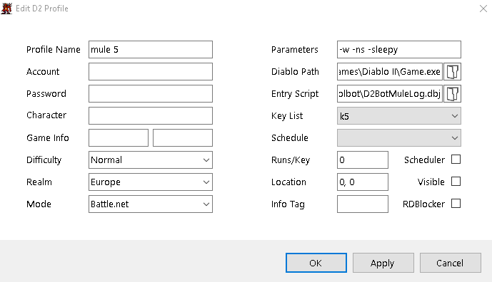
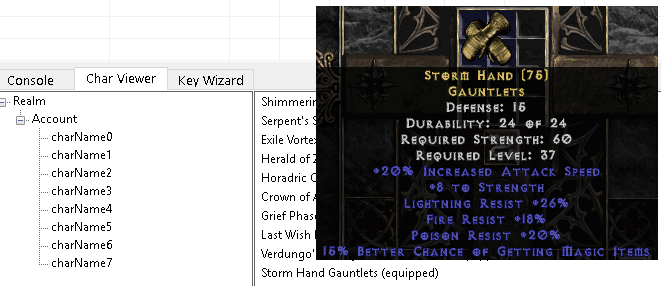
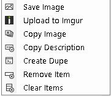
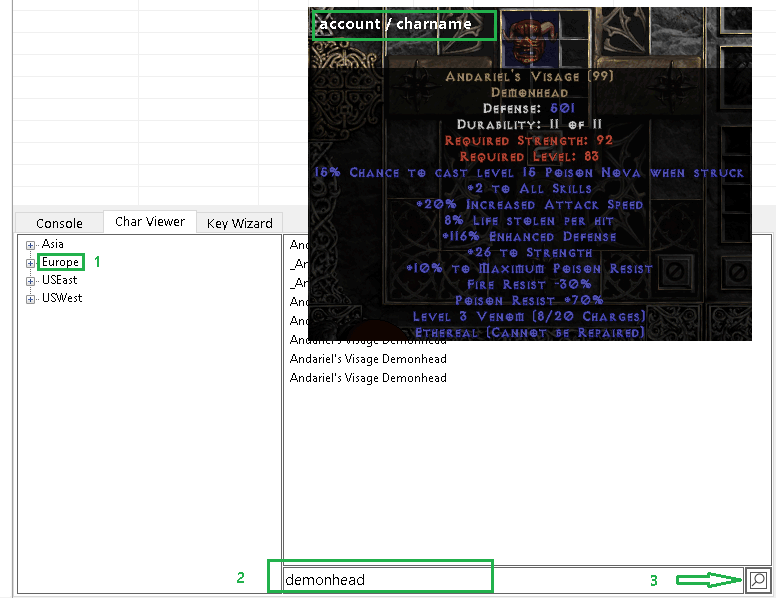
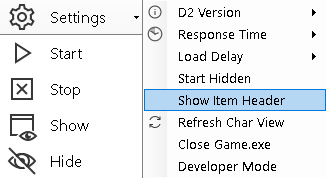

[general table of content](https://github.com/blizzhackers/documentation/#diablo-2-botting-system)

[kolbot table of content](https://github.com/blizzhackers/documentation/tree/master/kolbot/#kolbot)

---

# D2BotMuleLog

### info
It's a D2BS starter script which allow to log the items from inventory, stash and the equipped ones (including merc) to text files, then to show them in the <Char Viewer> tab of the manager.

### how to set up
In MuleLogger.js lines 21 and 24 have to be set:
```
		"account/password/realm": ["all"]
```
! the realm should be written with lowercase letters (see line 16), otherwise you'll get an error in OOG.js
```
	LogGame: ["", ""], // ["gamename", "password"]
```


At the first run set the next variables (lines 25-30):
```
	LogNames: true, // Put account/character name on the picture
```
! set false if you wanna use your item images ...(related to SaveScreenShot: true)
```
	LogItemLevel: true, // Add item level to the picture
	LogEquipped: false, // include equipped items
	LogMerc: false, // include items merc has equipped (if alive)
	SaveScreenShot: false, // Save pictures in jpg format (saved in 'Images' folder)
	IngameTime: rand(180, 210), // (180, 210) to avoid RD, increase it to (7230, 7290) for mule perming
```

LogEquipped - will be logged all items,  but the potions/tomes or other low level items will be skipped from log - see **skipItem** function from Misc.js.

In case of logging all the chars (the visible 8), at the end the d2 will be reset to main screen, re-login and after rechecking the first char it will be closed automatically by the manager and the related profile, too. This isn't working in case of setting a single mule char, when you have to stop that profile manually.

The profile doesn't need all fields completed:


* Location coordinates only if Visible is checked

there will be automatically created in ...\mules\ the "Realm\Account\" subfolders. Charnames will be ordered alphabetically.


the logging info for items includes the shapes and other details and you'll see on mouse over the image of the item (other than the screenshots from Images folder):



and with R-click you have these option for saved items:



You'll have that info in the "Char Viewer" tab of the manager console as long as you keep those log files in ...\mules\ folder. Those will be automatically loaded at every D2Bot.exe start, but there is an option in Settings > Refresh Char View, to reload the logging files.
Every item is saved on different line, so you can edit those logging files easily with notepad++.

It will be saved in ...\logs\MuleLog.json the current account and the current charname. This have to be edited or removed in case of crashes when some chars were omitted from logging. At the end of full account logging, that file is deleted automatically.
### searching for items
In the left box of <Char Viewer> tab, select the branch (Realm or Account) where you are trying to find the item. Use the right-bottom search box. It accepts regular expressions, so you can search for just about anything as long as the query is correctly written.



The account/charname will be logged automatically (and help you in searching items) and you'll see on mouse over the item list, the "account / charname" in top-left of that image if in the manager Settings is activated the option 


If you wanna save the image (check R-click options) of an item without having this info, 

.

You will find the images near D2Bot.exe in the subfolder \images , the same location for screenshots made during the logging.

Check [@rivx mule view project](http://www.rivsoft.net/projects/other/muleview/) and download [MuleView-v0.3.zip](http://www.rivsoft.net/download/other/MuleView-v0.3.zip) which allows you to view the logged files saved with d2bs. [original shared topic](https://web.archive.org/web/20150613144010/http://www.blizzhackers.cc:80/viewtopic.php?f=172&t=500047)

### dropper
It's a free public dropper - limedrop, included in the default branch (master = trunk) of repository
- browser link <https://github.com/kolton/kolbot-with-kolbot/tree/master>
- download link for TortoiseSVN <https://github.com/kolton/kolbot-with-kolbot/trunk/>
- check the [discord limedrop channel](https://discordapp.com/channels/430522386253611018/482930024681439242):

* [About limedrop](https://github.com/blizzhackers/documentation/tree/master/limedrop#about-limedrop)
* [Setup Limedrop](https://github.com/blizzhackers/documentation/tree/master/limedrop#setup-limedrop)
* [Using Limedrop](https://github.com/blizzhackers/documentation/tree/master/limedrop#using-limedrop)
* [FAQ](https://github.com/blizzhackers/documentation/tree/master/limedrop#frequently-asked-questions)


### diabase & d2bs
[@Ned](https://github.com/Nedkali/) added some changes to Diabase to work with D2BS - see this 
- download using SVN Checkout... -> <https://github.com/Nedkali/DiaBaseV1/trunk>
- create a subfolder ...\d2bs\kolbot\MuleInventory\
- you have the option to not use the Diabase function which overwrite the files, using Utilities > Verify logging files, and it's enough to replace the default libs\MuleLogger.js with <https://pastebin.com/raw/5AkYLwNU> - which will create the both log files for the default D2BS Char Viewer (in mules\realm\account) and Diabase(in MuleInventory\).