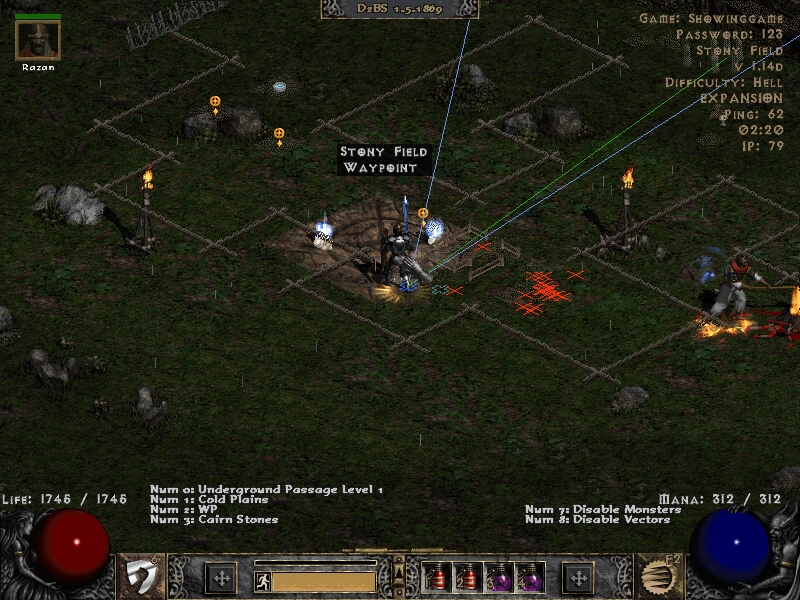
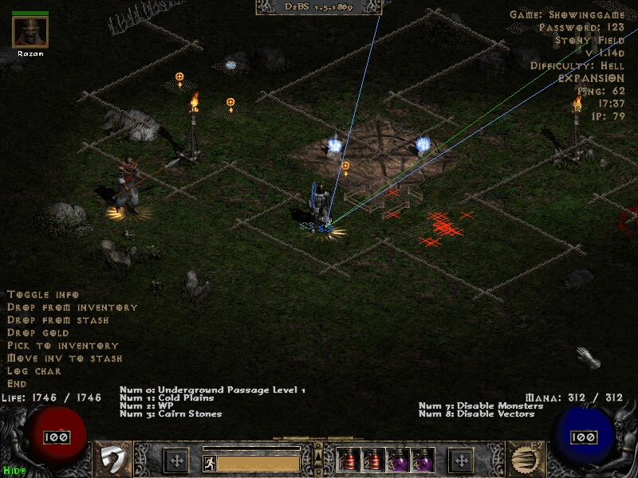

[general table of content](https://github.com/blizzhackers/documentation/#diablo-2-botting-system)

[kolbot table of content](https://github.com/blizzhackers/documentation/tree/master/kolbot/#kolbot)

---

# Manual Playing

---

* [Info](#info)
* [D2BotMap](#d2botmap)
* [Multi Loader](#multi-loader)
* [Manual Misc Script](#manualjs)
* [Using Followers](#using-followers)

---

## info

* [d2bs](https://github.com/kolton/d2bot-with-kolbot) allows manual playing

## multi loader

* use these parameters in the profile, and no script will be loaded.
```
	-L -w
```

## D2BotMap

1. it's a starter script for manual play.
2. you have to manually login into account and create or join game.
3. it gives you some improvements like:

	* reveals map
	* loads chicken/potion/fastmod from character config
	* shows ping
	* shows game time
	* shows vectors
	* displays IP
	* with numpad key 0 - goes to next area
	* with numpad key 1 - goes to previous area
	* with numpad key 2 - goes to wp and grab it (if possible)
	* with numpad key 3 - goes to boss from quest (if possible)
	* with numpad key 7 - disables monsters
	* with numpad key 8 - disables vectors

4. to see all details properly, change the resolution to 800x600 in game settings!



5. if you wanna view maps + monsters while you are pressing < ALT > key you have to search to the line 727 of kolbot\tools\MapThread.js and to remove the 0x0D code. After that line is looking:
```javascript
        hideFlags = [0x09, 0x0C, 0x01, 0x02, 0x0F, 0x18, 0x19, 0x21];
```
6. if you want to use it with followers, and to activate LocalChat, you should add some extra lines in [default.dbj - part related to d2botmap](https://github.com/kolton/d2bot-with-kolbot/blob/master/d2bs/kolbot/default.dbj#L40-L47)
```javascript
	if (getScript("d2botmap.dbj")) {
		load("tools/mapthread.js");
		load("tools/ToolsThread.js");
		Config.init(true);
		LocalChat.init();

		while (true) {
			delay(1000);
		}
	}
```

## Manual.js

1. it's another script written by [@Laz](https://github.com/laztheripper) for manual play, with description in this saved [html file](assets/ManualPlayScriptWithPacketSniffingToolsAndMore.html) or [pdf format](https://github.com/blizzhackers/bhfiles/blob/master/pdf%20saved%20pages/d2bs%20script%20development/Manual%20play%20script%20with%20packet%20sniffing%20tools%20and%20more.pdf). 
2. How to use (from bh topic):
	* copy the script [Manual.js](https://raw.githubusercontent.com/blizzhackers/documentation/blob/master/kolbot/assets/Manual.js) and save it in a new file named "Manual.js" in "libs/bots" folder
	* in your character's config add "Scripts.Manual = true;"
	* use D2BotBlank.dbj as starter script(entry point) for the profile.
	* in d2bs.ini (located in kolbot/d2bs) set "UseGamePrint=true", otherwise you won't see anything useful ingame.



3. if you wanna view maps + monsters while you are pressing < ALT > key you have to search to the line 727 of kolbot\tools\MapThread.js and to remove the 0x0D code. After that line is looking:
```javascript
        hideFlags = [0x09, 0x0C, 0x01, 0x02, 0x0F, 0x18, 0x19, 0x21];
```

## using followers

you can run your leader and to have up to other 7 followers in your game.
check [multibotting - joining games](https://github.com/blizzhackers/documentation/blob/master/kolbot/MultiBotting.md/#joining-games)
