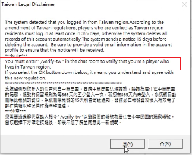

[general table of content](https://github.com/blizzhackers/documentation/#diablo-2-botting-system)

[kolbot table of content](https://github.com/blizzhackers/documentation/tree/master/kolbot/#kolbot)

---

# Miscellaneous Options

---

* [local chat](#local-chat)
* [updated Autosmurf](#updated-Autosmurf)
* [Autochaos](#Autochaos)
* [modded BattleOrders.js](#modded-BattleOrdersjs)
* [walking char](#walking-char)
* [how to define your own party and permit hardcore loot corpses](#how-to-define-your-own-party-and-permit-hardcore-loot-corpses)
* [Baal.js with adds for hdin on wave 2](#Baaljs-with-adds-for-hdin-on-wave-2)
* [staggered delays for creating games](#staggered-delays-for-creating-games)
* [quit with logging items](#quit-with-logging-items)
* [picking and selling junk items](#picking-and-selling-junk-items)
* [picking and selling valuable items](#picking-and-selling-valuable-items)
* [opening all chests](#opening-all-chests)
* [open chests only from specific areas](#open-chests-only-from-specific-areas)
* [silenced Follower](#silenced-Follower)
* [LifeChicken restart profile](#lifechicken-restart-profile)
* [use Cain and sell items](#use-Cain-and-sell-items)
* [sell cubing items](#sell-cubing-items)
* [inventory full](#inventory-full)
* [cubing all kind of gems](#cubing-all-kind-of-gems)
* [Taiwan disclaimer](#taiwan-disclaimer)
* [Diabase & D2BS](#Diabase--D2BS)
* [silencing the scripts](#silencing-the-scripts)

---

## local chat

* [@noah-](https://github.com/noah-) added in the char configuration files the options:
	```javascript
		// Public game options

		// If LocalChat is enabled, chat can be sent via 'sendCopyData' instead of BNET
		// To allow 'say' to use BNET, use 'say("msg", true)', the 2nd parameter will force BNET
		// LocalChat messages will only be visible on clients running on the same PC
		Config.LocalChat.Enabled = true; // enable the LocalChat system
		Config.LocalChat.Toggle = false; // optional, set to KEY value to toggle through modes 0, 1, 2
		Config.LocalChat.Mode = 2; // 0 = disabled, 1 = chat from 'say' (recommended), 2 = all chat (for manual play)
	```
* MFTeam is ok with LocalChat in mode 1
* [Manual played leader and Follower.js](https://github.com/blizzhackers/documentation/blob/master/kolbot/MultiBotting.md/#using-followers) - LocalChat in mode 2

	

## updated Autosmurf
* [@Dark-f](https://github.com/Dark-f/) updated the [JeanMax/AutoSmurf](https://github.com/JeanMax/AutoSmurf)
	- the files can be found on https://github.com/blizzhackers/autosmurf repository
	- check this @Dark-f video https://www.youtube.com/watch?v=rTXM9szlIdw

* other autosmurf version can be be downloaded with tortoiseSVN (add /trunk) from <https://github.com/blizzhackers/kolbot-sonic/>
	- the description can be found on https://github.com/blizzhackers/kolbot-sonic/blob/master/SetupSonic.md/#sonic-setup
	- many thanks to [Laz](https://github.com/laztheripper) - the author of sonic scripts.
	- it is a modified version of d2bs for sorceress chars, so check D2BotSonic.dbj starter script, config files ...\libs\config\Sorceress.js and ...\libs\config\Builds\Sorceress.Sonic.js 
	- it have its modified files in ...\kolbot\libs\sonic\

## Autochaos

* by [@noah-](https://github.com/noah-), without explicit communication in game.
* https://gist.github.com/noah-/2685fbeccc72fd595bbe89116aea272e
* check also the comments there
* you can post the results on discord [#testing channel](https://discordapp.com/channels/430522386253611018/430534815549358080)

## modded BattleOrders.js
* reason = the default script was programmed to do only a single BOgive - BOget at the beggining of the game. Maybe it wasn't necessary a 2nd one, because games were shorter in those d2 server times without a lot of restrictions, which were applied in the meantime.

* by [@nag0k](https://github.com/nag0k) - https://pastebin.com/JTmWbqLf or [BattleOrders.js on github](https://raw.githubusercontent.com/blizzhackers/documentation/master/kolbot/custom-scripts/BattleOrders.js)- replace the default ...\libs\bots\BattleOrders.js
* barbarian will go to the waypoint of your choosing and bo anyone that is nearby if they have bo or not. It will go back to town if monsters come close to the boer. It will go back to town and visit a healer NPC if it's mana gets below a set percentage then return to continue giving bo.

* there are some settings at the top of the script you can change:
	```javascript
		const BO_WP = 35; // area to buff - 35 is catacombs level 2
		const TOWN_NEARBY_MONSTER = true; // go to town if monsters nearby
		const TOWN_MANA = 20; // go refill mana if mana drops below this percent
	```
* BO_WP sets what wp to bo at, 35 is default which is catacombs level 2.
* TOWN_NEARBY_MONSTER makes the barb go to town if monsters come too close.
* TOWN_MANA makes the barb go refill it's mana if it drops below this percentage, if mana drops below 20% the barb will go heal by default.

* Notes:
	* only for giving BO, so only in barbarian config file:
		```javascript
			// Battle orders script - Use this for 2+ characters (for example BO barb + sorc)
			Scripts.BattleOrders = true;
		```
	* the other parameters are useless.
	* in barbarian config Config.QuitList = ["..."]; should be completed.
	* this script is only the "barb giving bo" component, so it's not really compatible with the current BattleOrders unless you do what you done and make the characters receiving bo to go on the Boer wp first, by adding in your running scripts the following lines:
		```javascript
			Pather.useWaypoint(35, true); // take Boer wp
			Pather.moveTo(me.x + 5, me.y + 5);
			delay(3000);
		```

## walking char

* you can add a variable in the char config ([maybe ~ line24](https://github.com/blizzhackers/kolbot/blob/master/d2bs/kolbot/libs/config/Sorceress.js#L24), just after BattleOrders section), like:
	```javascript
	
		Config.WalkingChar = true;
	
	```

* in [Config.js line 277](https://github.com/blizzhackers/kolbot/blob/master/d2bs/kolbot/libs/common/Config.js#L277) add
	```
		WalkingChar: false,

	``` 
	this is the default option if you don't have it in char config and prevent other errors.

* finally, add it in the line https://github.com/blizzhackers/kolbot/master/d2bs/kolbot/libs/common/Pather.js#L121 , so you'll get smth like 
	```javascript
        return this.teleport && !me.getState(139) && !me.getState(140) && !me.inTown && !Config.WalkingChar && ((me.classid === 1 && me.getSkill(54, 1)) || me.getStat(97, 54));
	```
	if that **Config.WalkingChar = true** in the char config, the result should be **use.teleport = false**

* something similar with [this suggested option](https://github.com/blizzhackers/documentation/commit/f83800af39991199a72473344ce05f94ccdeb969) was merged in the kolbot repository with this [pull-request](https://github.com/blizzhackers/kolbot/pull/3)


## how to define your own party and permit hardcore loot corpses
* It is a public mode when your players invite and accept other players invites, only if their names are in your previously configured MyOwnParty list

* in char config file, look to the // Public game options section and you have to add (line Config.PublicMode is already there, so add only options 4 and 5 (use 4 only for char who's opening the game, and 5 for the others)
	```javascript
		Config.PublicMode = 4; // 1 = invite and accept, 2 = accept only, 3 = invite only, 4 = MyOwnParty invite, 5 = MyOwnParty accept, 0 = disable
		Config.MyOwnParty = []; // ["MyPlayer1", "MyPlayer2", "MyPlayer3"]
	```

* in ... libs\common\Config.js before line 161 DeathMessages add
	```javascript
		MyOwnParty: [],
	```
* and complete the same list on every char config that you will add in your team game, including all charnames.
    Config.MyOwnParty = ["MyPlayer1", "MyPlayer2", "MyPlayer3", "MyPlayer4"];

* check the changes in [modded Party.js](https://raw.githubusercontent.com/blizzhackers/documentation/master/kolbot/custom-scripts/Party.js) and replace the content of default Party.js, or make the following changes:
	* in ... \tools\Party.js add after [default SVN line 143](https://github.com/blizzhackers/kolbot/blob/master/d2bs/kolbot/tools/Party.js#L143) the cases 4 and 5
```javascript
					case 4: // MyOwnParty invite
						if (Config.MyOwnParty.indexOf(player.name) === -1) {
							break;
						}

						if (Config.MyOwnParty.length > 0) {
							var i;

							for (i = 0; i < Config.MyOwnParty.length; i += 1) {
								if (player.name == Config.MyOwnParty[i] && player.name !== me.name) {
									if (player.partyflag !== 4 && player.partyflag !== 2 && player.partyid === 65535) {
										clickParty(player, 2);

										if (me.playertype == 1) { // hardcore permit loot of leader to other char who is invited in the party
											clickParty(player, 0);
										}

										delay(500);
									}
								}
							}

						} else if (Config.MyOwnParty.length === 0 || Config.MyOwnParty.length === undefined) {
							Config.PublicMode = 1;
						}

						break;
					case 5: // MyOwnParty accept
						if (Config.MyOwnParty.indexOf(player.name) === -1) {
							break;
						}

						if (Config.MyOwnParty.length > 0) {
							var i;								

							for (i = 0; i < Config.MyOwnParty.length; i += 1) {
								if (player.name == Config.MyOwnParty[i] && player.name !== me.name) {
									if (player.partyflag === 2) {
										clickParty(player, 2);

										if (me.playertype == 1) { // hardcore permit loot to leader
											clickParty(player, 0);
											loot.push(player.name);
										}

										delay(500);
									}

									if (loot.indexOf(player.name) === -1 && me.playertype == 1) { // hardcore permit loot to other chars
										clickParty(player, 0);
										loot.push(player.name);
										delay(500);
									}
								}
							}

						} else if (Config.MyOwnParty.length === 0 || Config.MyOwnParty.length === "undefined") {
							Config.PublicMode = 2;
						}

						break;
```
	* in ... \tools\Party.js change [default line 74](https://github.com/blizzhackers/kolbot/blob/master/d2bs/kolbot/tools/Party.js#L74) with:
```javascript
	if (Config.PublicMode === 4 || Config.PublicMode === 5) {
		print("ÿc2Party thread loaded. ÿc0Mode: ÿc2MyOwnParty - " + ((Config.PublicMode === 5) ? "Accept" : "Invite"));
	} else print("ÿc2Party thread loaded. ÿc0Mode: ÿc2" + (Config.PublicMode === 2 ? "Accept" : "Invite"));
```
	* in ... \tools\Party.js add after [the default line 56](https://github.com/blizzhackers/kolbot/blob/master/d2bs/kolbot/tools/Party.js#L56) with:
```javascript
			case 0x00: // "%Name1(%Name2) dropped due to time out."
			case 0x01: // "%Name1(%Name2) dropped due to errors."
			case 0x03: // "%Name1(%Name2) left our world. Diablo's minions weaken."
				if (me.playertype == 1 && loot.indexOf(name1) > -1) { // hardcore leaving char is removed from loot 
					loot.splice(loot.indexOf(name1), 1);
				}

				break;
```
	* in ... \tools\Party.js change [the default line 22](https://github.com/blizzhackers/kolbot/blob/master/d2bs/kolbot/tools/Party.js#L22) with:
```javascript
		partyTick = getTickCount(),
		loot = [];
```

* there should be added infinite loops to stop dead HC player from other actions which will end the game because of errors, like in the case of Follower.js
```javascript
        if (me.playertype == 1 && me.mode === 17) { // stop the HC screen to allow the loot of dead player
            while(true) {
                delay(6e5);
            }
        }
```
* Notes:
	* on reload Chat/console in-game command, the permit loot become off for all other players because loot list is lost, but 2nd reload will swith the permit loot to on.
	* the players, which are permitted to loot a hardcore player corpse, can get the equipped items back, but the mercenary stuff is lost, and also lost are the items located in inventory and stash.
	* to implement the recovery of loot stuff on automatic bot characters there should be added more changes in the libs scripts. With low hp chicken values on high ping games maybe there will be errors to get the death when game is left, so the recovery can't be done.

## Baal.js with adds for hdin on wave 2

* https://pastebin.com/mnqySRqF copy and paste the text, replacing the content of ...\libs\bots\Baal.js file.
* the adds for pala hdin consist in an extra function for wave 2 (without having the Nature's Peace ring, which is making this unnecessary). You have to set in hdin config file for wave 2

	```javascript
		Config.AttackSkill[5] = 97; // Secondary skill if monster is immune to primary.
		Config.AttackSkill[6] = 113; // Secondary aura.
	```

* try to have Holy Shield at max points, and hdin Smite dmg will be around 1.8-2 k physical dmg with concentration aura, which will increase also the mercenary's dmg.

## staggered delays for creating games
* For running more solo bots(game creators) you should bypass the 2 min d2 server restriction for consecutive creation of games/same IP.

* Note: apply it only if you run more game creator bots, and test first without it, someone on discord is saying that it isn't required the staggering like in the previous ladder season.

* a staggered version of ...\d2bs\kolbot\D2BotLead.dbj  https://pastebin.com/u02RH1C2 or [D2BotLeadStagger.dbj on github](https://raw.githubusercontent.com/blizzhackers/documentation/master/kolbot/custom-scripts/D2BotLeadStagger.dbj)
* copy and paste the text, and save it ...\kolbot\D2BotLeadStagger.dbj

* this will create ...\logs\gameStagger.txt file and you'll see a message in status "Lobby - stagger time: (...s)" if the stagger delay wasn't reached.
* in case of errors or too high values shown on d2bs status line, delete the gameStagger.txt and it will be written again.

* staggerDelay was set to random value 120 - 130 sec (line 360), and CreateGameDelay to random value 10-15 sec (line 8)

## quit with logging items

* for manual quit and stop a profile on the latest run, add after [line 355 of ToolsThread.js](https://github.com/blizzhackers/kolbot/blob/master/d2bs/kolbot/tools/ToolsThread.js#L355):
```javascript
		case 35: // End key
			MuleLogger.logChar(); // log the char
			delay(rand(2e3, 5e3));
			D2Bot.printToConsole(me.profile + " - end run " + me.gamename);
			D2Bot.stop(me.profile, true);

			break;
```
* the < END > key can be used to quit with logging items at the end of runs.
* with multiple chars in the game you can replace **delay(rand(2e3, 5e3));** with the already set values of **Config.QuitListDelay** :
```javascript
			delay(rand(Config.QuitListDelay[0] * 1e3, Config.QuitListDelay[1] * 1e3));
```

## picking and selling junk items

* if your low bot need gold, you should activate the picking of junk items.
* if total gold is less than Config.LowGold value pick up anything worth 10 gold per square to sell in town.

* you should add in the char configuration file:
	```javascript
		Config.LowGold = 200000 // any low item with 10 gold per square will be picked and sold to NPC until me.gold < Config.LowGold
	```
that variable is already defined in Config.js (line 138, where it is set to 0), and it is used in [Pickit.js line 64](https://github.com/blizzhackers/kolbot/blob/master/d2bs/kolbot/libs/common/Pickit.js#L64) and [Town.js line 526](https://github.com/blizzhackers/kolbot/blob/master/d2bs/kolbot/libs/common/Town.js#L526)

you could comment the [line 58 from Town.js](https://github.com/blizzhackers/kolbot/blob/master/d2bs/kolbot/libs/common/Town.js#L58) , in order to pick the [throwing potions](http://classic.battle.net/diablo2exp/items/potions.shtml)
```javascript
		//38, // Missile Potion
```
* if you don't wanna pick arrows/bolts you should increase the value **10** from [line 73 of Pickit.js](https://github.com/blizzhackers/kolbot/blob/master/d2bs/kolbot/libs/common/Pickit.js#L73) to any other value like 15 or 20.

## picking and selling valuable items

* if your bot need gold, to gamble more often, you should set the picking of valuable items including white ones, which worth more than 2k gold (customizable) / square.
* add in the character configuration file:
	```javascript
		Config.PickValuableItems = true; // pick everything worth > 2k gold/square
	```
* add after [ line 138 (LowGold) in ... libs\common\Config.js](https://github.com/blizzhackers/kolbot/blob/master/d2bs/kolbot/libs/common/Config.js#L138):
	```javascript
		PickValuableItems: false,
	```
* add after [line 80 in Pickit.js](https://github.com/blizzhackers/kolbot/blob/master/d2bs/kolbot/libs/common/Pickit.js#L80):
	```javascript
		// pick valuable items which worth more than 2k gold/square to sell in town, if Config.PickValuableItems = true.
		var dontSell = [
						557, 558, 559, 560, 561, 562, 563, 564, 565, 566, 567, 568, 569, 570, 571, 572, 573, 574, 575, 576, 577,
						578,579, 580, 581, 582, 583, 584, 585, 586, 597, 598, 599, 600, 601, // gems
						610, 611, 612, 613, 614, 615, 616, 617, 618, 619, 620, 621, 622, 623, 624, 625, 626, 627, 628, 629, 630,
						631, 632, 633, 634, 635, 636, 637, 638, 639, 640, 641, 642 // runes
						];

		if (rval.result === 0  && Config.PickValuableItems && unit.itemType !== 39 && dontSell.indexOf(unit.classid) === -1) { // exclude quest items, gems and runes
			if (unit.getItemCost(1) / (unit.sizex * unit.sizey) >= 2e3) {
				return {
					result: 7,
					line: null
				};
			}
		}

	```
* note that the 9th line is customizable, adding only the value of the item (like 5k gold) or a mixed line with previous example (2k gold/square):
```javascript
			if (unit.getItemCost(1) >= 5e3 || (unit.getItemCost(1) / (unit.sizex * unit.sizey) >= 2e3)) {
```
* add after [line 1942 in Town.js](hhttps://github.com/blizzhackers/kolbot/blob/master/d2bs/kolbot/libs/common/Town.js#L1942):
	```javascript
				case 7: // Sell valuable item > 2k gold/square
					try {
						print("val.items sell " + items[i].name + " - " + items[i].getItemCost(1) + " gold");
						this.initNPC("Shop", "clearInventory");
						Misc.itemLogger("Sold", items[i]);
						items[i].sell();
					} catch (e) {
						print(e);
					}

					break;
	```
* maybe the npc town visit will be more often, but large amounts of gold will be get faster.


## opening all chests
* if you want to open all chests during clearing, set in char configuration file
	```javascript
		Config.OpenChests = true;
	```
* add the changes to Attack.js, so line [1024 from Attack.js](https://github.com/blizzhackers/kolbot/blob/master/d2bs/kolbot/libs/common/Attack.js#L1024) 
```javascript
			ids = ["chest", "chest3", "weaponrack", "armorstand"];
```
	will be changed to:
```javascript
            ids = ["chest", "loose rock", "hidden stash", "loose boulder", "corpseonstick", "casket", "armorstand", "weaponrack", "barrel",
                "holeanim", "tomb2", "tomb3", "roguecorpse", "ratnest", "corpse", "goo pile", "largeurn", "urn", "chest3", "jug", "skeleton",
                "guardcorpse", "sarcophagus", "object2", "cocoon", "basket", "stash", "hollow log", "hungskeleton", "pillar", "skullpile",
                "skull pile", "jar3", "jar2", "jar1", "bonechest", "woodchestl", "woodchestr", "barrel wilderness", "burialchestr", "burialchestl",
                "explodingchest", "chestl", "chestr", "groundtomb", "icecavejar1", "icecavejar2", "icecavejar3", "icecavejar4", "deadperson",
                "deadperson2", "evilurn", "tomb1l", "tomb3l", "groundtombl"
                ];
```

## open chests only from specific areas

1. in char config you should set:
```javascript
	Config.OpenChests = true; // Open chests. Controls key buying.
```

2. add in [Misc.js before default line 988](https://github.com/blizzhackers/kolbot/blob/master/d2bs/kolbot/libs/common/Misc.js#L988) '    shrineStates: false,'  (and feel free to add any other area where you wanna open chests, using sdk\areas.txt) :
```javascript

	// open chests only from these areas -> Pather.popChests
	openAreaChests: function (area) {
		if (!area) {
			area = me.area;
		}

		switch (area) {
		case  79: // Lower Kurast
		case 102: // Durance Of Hate Level 3
			return true;
		}

		return false;
	},

```

3. [the default 54th line from Pather.js](https://github.com/blizzhackers/kolbot/blob/master/d2bs/kolbot/libs/common/Pather.js#L54) should be:
```javascript
		if (!!Config.OpenChests && Misc.openAreaChests()) {
```

4. [the default 1013th line from Attack.js](https://github.com/blizzhackers/kolbot/blob/master/d2bs/kolbot/libs/common/Attack.js#L1013) should be:
```javascript
		if (!Config.OpenChests && !Misc.openAreaChests()) {
```

## silenced Follower
* reason = to avoid the muting of keys. 
* thanks to [@noah-](https://github.com/noah-), if you set the LocalChat on mode 2, you should no worry about d2 server chat.

* the default script ...\d2bs\kolbot\libs\bots\Follower.js is a wonderful written script, but it was working only by using chat commands to move to leader position, take portals, ...

* without the LocalChat active in mode 2, the follower reporting have to be silenced changing **say(** with **print(** or me.overhead (server side function of d2bs, other players don't see that).
* the default Follower.js has set town activities only with command, and in the case of silenced it was changed to do town activities at the start of the game and just after every leader move to town. Cain can be used to identify items, but before setting that check the [section related](#use-cain-and-sell-items), below.

* https://pastebin.com/LnXCQ3ES or [FollowerSilent.js on github](https://raw.githubusercontent.com/blizzhackers/documentation/master/kolbot/custom-scripts/FollowerSilent.js) - copy and paste the text (or download that paste), in a new file ...\bots\FollowerSilent.js.
This modded script has some adds, check the top of it. And you should add a new line in the character configuration file:
```javascript
	Scripts.FollowerSilent = true; // a custom automated Follower.js
```

## LifeChicken restart profile
* by default LifeChicken will exit game
* if you wanna close d2 window (like the d2nt method) instead exiting game, you should think about restarting the current d2bot profile:

	* add in Config.js after https://github.com/blizzhackers/kolbot/blob/master/d2bs/kolbot/libs/common/Config.js#L117 :
	```javascript
		LifeChickenRestart: false,
	```

	* add in char config file:
	```javascript
		Config.LifeChickenRestart = true; // Restart profile if LifeChicken is activated
	```

	* in ToolsThread.js replace https://github.com/blizzhackers/kolbot/blob/master/d2bs/kolbot/tools/ToolsThread.js#L564 with:
	```javascript
						Config.LifeChickenRestart ? D2Bot.restart() : this.exit();
	```

## use Cain and sell items
* the item identifying on Cain will end with dropping the unwanted items by default. That was the reason to add a variable with minimum gold, just under the enabling ID at Cain.

* add in the character configuration file in Cain section:
	```javascript
		Config.CainID.Drop = false; // drop items identified at Cain
	```
* set a lower gold limit for using Cain, like 100.000 or 0:
	```javascript
		Config.CainID.MinGold = 0; // Minimum gold (stash + character) to have in order to use Cain.
	```
* add after [line 148 (CainID.Enable) in ... libs\common\Config.js](https://github.com/blizzhackers/kolbot/blob/master/d2bs/kolbot/libs/common/Config.js#L148):
	```javascript
			Drop: false,
	```
* change the [lines 711-715 in ...\libs\common\Town.js](https://github.com/blizzhackers/kolbot/blob/master/d2bs/kolbot/libs/common/Town.js#L711-L715) with:
	```javascript
				case 0:
					if (!Config.CainID.Drop) {
						Misc.itemLogger("Shopped", unids[i], "cainID");
						this.initNPC("Shop", "clearInventory");
						unids[i].sell();
					} else {
						Misc.itemLogger("Dropped", unids[i], "cainID");
						unids[i].drop();
					}

					break;
	```


## sell cubing items
by default the cubing items will be dropped if them not meet the condition to be kept. You should replace [the default lines 967-971 from Cubing.js](https://github.com/blizzhackers/kolbot/blob/master/d2bs/kolbot/libs/common/Cubing.js#L967-L971) with:
```javascript
						case 0:
							Misc.itemLogger("Sold", items[j], "doCubing");
							Town.initNPC("Shop", "clearInventory");
							items[j].sell();

							break;
```
* if you get warnings/errors after the cubing is done, you should revert those lines to default.

## inventory full
* If you don't wanna to set the [Automule](https://github.com/blizzhackers/documentation/blob/master/kolbot/Automule.md/#automule) option, or you don't have too many d2/lod keys to do that, you can set the stop of the profile.
* again, some old etal users may need this function.

* add in char configuration file (at the end of General config section, ~ line 400), a new variable:
	```javascript
		Config.InventoryFull = true; // stop profile if inventory full
	```

* then edit Config.js and add after line ~ 204
	```javascript
		InventoryFull: false,
	```

* finally, look for the default [lines 145-148 from Pickit.js](https://github.com/blizzhackers-d2/d2bot-with-kolbot/blob/master/d2bs/kolbot/libs/common/Pickit.js#L145-L148)and change them to:
```javascript
							// Town visit failed - abort
							print("ÿc7Not enough room for " + this.itemColor(pickList[0]) + pickList[0].name);

							if (Config.InventoryFull) {
								D2Bot.printToConsole("Inventory Full. game: " + me.gamename + "char: " + me.account + " - " + me.name, 6);
								D2Bot.stop(me.profile, true);
							}

							return false;
```

## cubing all kind of gems
* if you wanna a bot from your team to cube all the gems found, you can add some changes:
* in the special pickit file for that char, you can have only the perfect gem lines
	```javascript
	[name] == perfectamethyst
	[name] == perfectdiamond
	[name] == perfectemerald
	[name] == perfectruby
	[name] == perfectsapphire
	[name] == perfecttopaz
	[name] == perfectskull
	```
* in ...\kolbot\libs\common\Cubing.js replace [default lines 201-204](https://github.com/blizzhackers/kolbot/blob/master/d2bs/kolbot/libs/common/Cubing.js#L201-L204) with:
```javascript
			case Recipe.Gem:
				switch (Config.Recipes[i][1]) {
				case 557: // chipped amethyst
				case 558: // flawed amethyst
				case 559: // amethyst
				case 560: // flawless amethyst
				case 562: // chipped topaz
				case 563: // flawed topaz
				case 564: // topaz
				case 565: // flawless topaz
				case 567: // chipped sapphire
				case 568: // flawed sapphire
				case 569: // sapphire
				case 570: // flawless sapphire
				case 572: // chipped emerald
				case 573: // flawed emerald
				case 574: // emerald
				case 575: // flawless emerald
				case 577: // chipped ruby
				case 578: // flawed ruby
				case 579: // ruby
				case 580: // flawless ruby
				case 582: // chipped diamond
				case 583: // flawed diamond
				case 584: // diamond
				case 585: // flawless diamond
				case 597: // chipped skull
				case 598: // flawed skull
				case 599: // skull
				case 600: // flawless skull
					this.recipes.push({Ingredients: [Config.Recipes[i][1], Config.Recipes[i][1], Config.Recipes[i][1]], Index: Recipe.Gem, AlwaysEnabled: true});

					break;
				}

				break;
```
* in character configuration file should be added in the cubing config section (default lines ~320-326 have the cubing of the flawless to perfect gems):
	```javascript
		Config.Recipes.push([Recipe.Gem, "Chipped Amethyst"]); // make FlawedAmethyst
		Config.Recipes.push([Recipe.Gem, "Chipped Topaz"]); // make Flawed Topaz
		Config.Recipes.push([Recipe.Gem, "Chipped Sapphire"]); // make Flawed Sapphire
		Config.Recipes.push([Recipe.Gem, "Chipped Emerald"]); // make Flawed Emerald
		Config.Recipes.push([Recipe.Gem, "Chipped Ruby"]); // make Flawed Ruby
		Config.Recipes.push([Recipe.Gem, "Chipped Diamond"]); // make Flawed Diamond
		Config.Recipes.push([Recipe.Gem, "Chipped Skull"]); // make Flawed Skull
 
		Config.Recipes.push([Recipe.Gem, "Flawed Amethyst"]); // make Amethyst
		Config.Recipes.push([Recipe.Gem, "Flawed Topaz"]); // make Topaz
		Config.Recipes.push([Recipe.Gem, "Flawed Sapphire"]); // make Sapphire
		Config.Recipes.push([Recipe.Gem, "Flawed Emerald"]); // make Emerald
		Config.Recipes.push([Recipe.Gem, "Flawed Ruby"]); // make Ruby
		Config.Recipes.push([Recipe.Gem, "Flawed Diamond"]); // make Diamond
		Config.Recipes.push([Recipe.Gem, "Flawed Skull"]); // make Skull
 
		Config.Recipes.push([Recipe.Gem, "Amethyst"]); // make Flawless Amethyst
		Config.Recipes.push([Recipe.Gem, "Topaz"]); // make Flawless Topaz
		Config.Recipes.push([Recipe.Gem, "Sapphire"]); // make Flawless Sapphire
		Config.Recipes.push([Recipe.Gem, "Emerald"]); // make Flawless Emerald
		Config.Recipes.push([Recipe.Gem, "Ruby"]); // make Flawless Ruby
		Config.Recipes.push([Recipe.Gem, "Diamond"]); // make Flawless Diamond
		Config.Recipes.push([Recipe.Gem, "Skull"]); // make Flawless Skull

		Config.Recipes.push([Recipe.Gem, "Flawless Amethyst"]); // make Perfect Amethyst
		Config.Recipes.push([Recipe.Gem, "Flawless Topaz"]); // make Perfect Topaz
		Config.Recipes.push([Recipe.Gem, "Flawless Sapphire"]); // make Perfect Sapphire
		Config.Recipes.push([Recipe.Gem, "Flawless Emerald"]); // make Perfect Emerald
		Config.Recipes.push([Recipe.Gem, "Flawless Ruby"]); // make Perfect Ruby
		Config.Recipes.push([Recipe.Gem, "Flawless Diamond"]); // make Perfect Diamond
		Config.Recipes.push([Recipe.Gem, "Flawless Skull"]); // make Perfect Skull
	```

* if picking a lot of gems will highly increase the number of the lines in d2bs manager item log tab, check the proper settings in the **// Manager Item Log Screen** section from character config file


## Taiwan Disclaimer
* in Taiwan region  blocks the d2 start.
* install https://www.autoitscript.com/site/autoit/downloads/
* check their documentation
* edit a new script in notepad++ (thanks to [Mercoory](https://github.com/Mercoory) + [emily785](https://github.com/emily785) - [posts](https://github.com/kolton/d2bot-with-kolbot/issues/1946#issuecomment-551206448):
```
While 1
	If WinExists("Taiwan Legal Disclaimer") Then
		WinWaitActive("Taiwan Legal Disclaimer")
		Send("{ENTER}")
	EndIf
	Sleep(1000)
WEnd
```
* save the script as TaiwanDisclaimer.au3
* run Autoit with administrative privileges


## Diabase & D2BS
@Ned added some changes to Diabase to work with D2BS

* download using SVN Checkout... -> (https://github.com/Nedkali/DiaBaseV1/trunk)
* create a subfolder ...\d2bs\kolbot\MuleInventory\
* you have the option to not use the Diabase function which overwrite the files, using Utilities > Verify logging files, and it's enough to replace the default libs\MuleLogger.js with https://pastebin.com/5AkYLwNU - which will create the both log files for the default D2BS Char Viewer (in mules\realm\account) and Diabase(in MuleInventory\).

## silencing the scripts
**me.overhead** command in d2bs is displayed only on client side, like the **print** command, too. Nobody in the same game cannot see those messages. Those are different than server chat messages starting with **!** symbol.
Some of d2bot-with-kolbot scripts aren't silenced by default, and in some cases like MFTeam, SealLeader/Leecher, Follower.js, a.s.o.  the functionality is made through chat expressions.

1. **if you are worried about server chat filter**, you can **set** [**Local Chat**](#local-chat) **true** and **mode 1** or **2**. Setting mode 1 in the case of MFTeam or SealLeader/Leecher, or mode 2 in the case of Followers.js is all you have to do to get all chat messages only on local client(d2 window).

2. if you don't wanna see any messages overhead, use notepad++ find and remove the text between quotes -> you'll get smth like:
	```
	me.overhead("");
	```
	
3. if you don't wanna see any chat messages:
	* check the config file and remove text between quotes -> you'll get smth like:
		```
		Config.  ... = "";
		```
	* and also check the Boss/Area script and remove the text between quotes in the line with **say("anytext");** -> so you'll get smth like:
		```
		say("");
		```

4. if you insist to silent your scripts, the easier option (@nag0k choice) is to add a function in ...\kolbot\default.dbj after line 92, which will change **say** into **me.overhead** or **print**:
	```javascript
	this.say = function (string) {
		me.overhead(string);
	};
	```
	```javascript
	this.say = function (string) {
		print(string);
	};
	```

5. other method:
	* for silencing Baal.js, look for [SVN line 196](https://github.com/blizzhackers/kolbot/blob/master/d2bs/kolbot/libs/bots/Baal.js#L196)
		```javascript
			say(string);
		```
	* comment this line adding **//** before say, or change **say** into **print**
	* do the same with lines [214](https://github.com/blizzhackers/kolbot/blob/master/d2bs/kolbot/libs/bots/Baal.js#L214) and [220](https://github.com/blizzhackers/kolbot/blob/master/d2bs/kolbot/libs/bots/Baal.js#L220), for the cases of dolls and souls.
	* in char configuration file you can remove the text between quotes "" , lines 85-88, 114-116, 220-223.
	* in Config.js you can remove the text between quotes in lines 344-346, and for Diablo 376-381
	* use np++ Find in Files looking for **say(** in whole d2bs folder. Then manually edit those results, changing them to (choose one):
		* **print(** - print on screen only
		* **me.overhead(** - a message displayed above bot head, but it's visible only for that char, and not in a d2 server chat.

