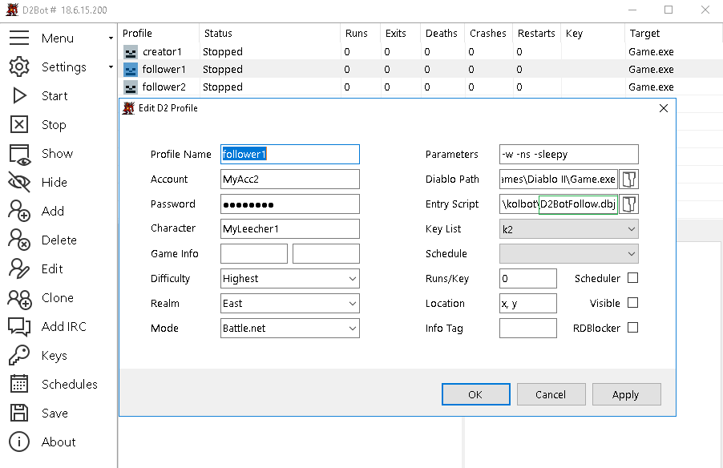
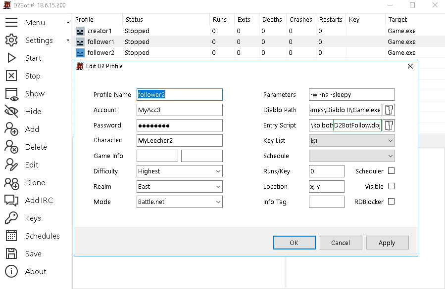

[general table of content](https://github.com/blizzhackers/documentation/#diablo-2-botting-system)

[kolbot table of content](https://github.com/blizzhackers/documentation/tree/master/kolbot/#kolbot)

---

# Multi Botting

---

* [Info](#info)
* [Game Creator](#game-creator)
	* [create/edit the profile](#createedit-the-profile)
	* [randomize the timers](#randomize-the-timers)
* [Joining Games](#joining-games)
	* [D2BotFollow](#d2botfollow)
		* [the joiners profiles](#the-joiners-profiles)
		* [randomize the timers](#randomize-the-timers-1)
		* [edit the joining info](#edit-the-joining-info)		
	* [D2BotChannel](#d2botchannel)
* [Team Games](#team-games)
	* [using MFTeam](#using-mfteam)
		* [MFLeader](#mfleader)
		* [MFHelper](#mfhelper)
		* [silenced MFTeam](#silenced-mfteam)
	* [using Followers](#using-followers)
	* [followers exit delays](#followers-exit-delays)
	* [dia-baal teams](#dia-baal-teams)

---

## Info
[d2bs](https://github.com/blizzhackers/kolbot) allows multi-botting.

## StarterConfig
Centralized location for shared config options. Entry script specific options are located at the top of the `*.dbj` file
### randomize the timers [libs/starter/StarterConfig.js](https://github.com/blizzhackers/kolbot/blob/69b48b27bb6b4b437edf7d3873a41cbbca09f6e7/d2bs/kolbot/libs/starter/StarterConfig.js#L10-L43)
```javascript
module.exports = {
    MinGameTime: rand(150, 180), // Minimum game length in seconds. If a game is ended too soon, the rest of the time is waited in the lobby
    PingQuitDelay: rand(30, 40), // Time in seconds to wait in lobby after quitting due to high ping
    CreateGameDelay: rand(5, 15), // Seconds to wait before creating a new game
    ResetCount: 999, // Reset game count back to 1 every X games.
    CharacterDifference: 99, // Character level difference. Set to false to disable character difference.
    MaxPlayerCount: 8, // Max amount of players in game between 1 and 8
    GameDescription: "", // Game description when creating a game
    StopOnDeadHardcore: true, // Stop profile character has died on hardcore mode

    // ChannelConfig can override these options for individual profiles.
    JoinChannel: "", // Default channel. Can be an array of channels - ["channel 1", "channel 2"]
    FirstJoinMessage: "", // Default join message. Can be an array of messages
    ChatActionsDelay: rand(2, 5), // Seconds to wait in lobby before entering a channel
    AnnounceGames: false, // Default value
    AfterGameMessage: "", // Default message after a finished game. Can be an array of messages

    InvalidPasswordDelay: rand(10, 15), // Minutes to wait after getting Invalid Password message
    VersionErrorDelay: rand(5, 30), // Seconds to wait after 'unable to identify version' message
    SwitchKeyDelay: rand(5, 15), // Seconds to wait before switching a used/banned key or after realm down
    CrashDelay: rand(60, 120), // Seconds to wait after a d2 window crash
    FTJDelay: rand(20, 30), // Seconds to wait after failing to create a game
    RealmDownDelay: rand(3, 7), // Minutes to wait after getting Realm Down message
    UnableToConnectDelay: rand(5, 10), // Minutes to wait after Unable To Connect message
    TCPIPNoHostDelay: rand(5, 30), // Seconds to wait after Cannot Connect To Server message
    CDKeyInUseDelay: rand(5, 10), // Minutes to wait before connecting again if CD-Key is in use.
    ConnectingTimeout: rand(20, 30), // Seconds to wait before cancelling the 'Connecting...' screen
    PleaseWaitTimeout: rand(10, 20), // Seconds to wait before cancelling the 'Please Wait...' screen
    WaitInLineTimeout: rand(60, 90), // Seconds to wait before cancelling the 'Waiting in Line...' screen
    WaitOutQueueRestriction: true, // Wait out queue if we are restricted, queue time > 10000
    WaitOutQueueExitToMenu: false, // Wait out queue restriction at D2 Splash screen if true, else wait out in lobby
    GameDoesNotExistTimeout: rand(30, 40) // Seconds to wait before cancelling the 'Game does not exist.' screen
};
```
* if you don't wanna join a chat channel, you don't have to edit anything more.
* the game creator can be also a manual played char, see [d2bs manual play](https://github.com/documentation/kolbot/ManualPlay.md/#manual-playing) page.

## AdvancedConfig
[libs/starter/AdvancedConfig.js](https://github.com/blizzhackers/kolbot/blob/69b48b27bb6b4b437edf7d3873a41cbbca09f6e7/d2bs/kolbot/libs/starter/AdvancedConfig.js#L39-L44) is used for overriding StarterConfig options for specific profiles.
```js
"Test": {
    JoinChannel: "op nnqry",
    JoinDelay: 3,
    AnnounceGames: true,
    AnnounceMessage: "Joining game" // output: Joining game Baals-23
},
```

## Game creator
* D2BotLead is the starter script that you will use to create games. It can announce games in channels when used for public runs. You have to set D2BotLead for your profile as a entry script. Now edit starter with your IDE of choice. First part of starter is self-explanatory. 
* the creator of the game doesn't necessarily to be set as the leader in game.

### Create/edit the profile
* you can also use the [D2BotLeadStagger](https://github.com/blizzhackers/documentation/blob/master/kolbot/MiscellaneousOptions.md/#staggered-delays-for-creating-games)- a staggered version of D2BotLead


## Joining games
There are different starter scripts for joining games:

* D2BotFollow.dbj - based on locally shared info between different profiles of the same d2bs manager

* D2BotChannel.dbj - based on info shared on chat channels

* D2BotPubJoin.dbj - based on scanning game list

### D2BotFollow
* joining chat channel isn't needed.
* the game name & password are shared locally through d2bs.

#### The joiners profiles




#### Randomize the join delay
replace the default line 12 of [D2BotFollow.dbj](https://github.com/blizzhackers/kolbot/blob/69b48b27bb6b4b437edf7d3873a41cbbca09f6e7/d2bs/kolbot/D2BotFollow.dbj#L12) with:
```javascript
// D2BotFollow specific settings - for global settings see libs/starter/StarterConfig.js
Starter.Config.JoinDelay = rand(5, 15); // Time in seconds to wait before join attempt
```

##### Edit the joining info
Edit [libs/systems/follow/FollowConfig.js](https://github.com/blizzhackers/kolbot/blob/69b48b27bb6b4b437edf7d3873a41cbbca09f6e7/d2bs/kolbot/libs/systems/follow/FollowConfig.js#L21C3-L23C5) and complete the JoinSettings

```js
  /**
   * @description Join game settings
   * - Format: "leader's profile": ["leecher 1 profile", "leecher 2 profile", ...]
   * - If you want everyone to join the same leader, use "leader's profile": ["all"]
   * - NOTE: Use *PROFILE* names (profile matches window title), NOT character/account names
   * - leader:leecher groups need to be divided by a comma
   * @example
   *  const JoinSettings = {
   *    "lead1": ["follow1", "follow2"],
   *    "lead2": ["follow3", "follow4"]
   *  };
   */
  const JoinSettings = {
    "Leader": ["Leecher"],
  };
```

### D2BotChannel
* D2BotChannel, is used to join games from both channel announcements and friend list announcements. That means that you can use this starter when want to join games that are runned on other computer. 
* edit [libs/systems/channel/ChannelConfig](https://github.com/blizzhackers/kolbot/blob/69b48b27bb6b4b437edf7d3873a41cbbca09f6e7/d2bs/kolbot/libs/systems/channel/ChannelConfig.js#L9) with the required settings

```js
  const ChannelConfig = {
    SkipMutedKey: true,
    MutedKeyTrigger: "Your account has had all chat privileges suspended.",
    JoinDelay: 10, // Seconds to wait between announcement and clicking join
    JoinRetry: 5, // Amount of times to re-attempt joining game
    // watch for whisper event instead?
    FriendListQuery: 0, // Seconds between "/f l" retries. 0 = disable. To prevent spamming when using set time rand(80, 160)
    /**
    * @typedef {Object} GameInfo
    * @property {string} game
    * @property {string} password
    *
    * @type {GameInfo[]}
    * @example
    * Games: [
    *   { game: "baal-", password: "" },
    * ],
    */
    Games: [
      { game: "FASTBAAL-", password: "" },
      { game: "csRun-", password: "password" },
      { game: "Kolbot-Runs", password: "otherpassword" },
    ],
    /**
     * @description excludeFilter format
     * @example <caption>Multiple entries in the same array mean AND</caption>
     *  // ignores games that contain "baal" and "-"
     *  const includeFilter = ["baal", "-"];
     * 
     * @example <caption>Multiple entries in different arrays mean OR</caption>
     *  // will ignore games with either "baal" or "diablo" in their name
     *  const includeFilter = [
     *    ["baal"],
     *    ["diablo"]
     *  ];
     * @type {Array<Array<string>>}
     */
    excludeFilter: [],
    /**
    * Leaders in game character name, only use this if the leader is using announce in the chat.
    * Can be an array or names ["somename", "somename2"]
    * @type {string[]}
    */
    Follow: [],
  };
```

* in this example we will join channel "MyChannel" and our first message will be "I'm from other dimension", in lines 2, 3 :
```javascript
	JoinChannel: "MyChannel", // Name of the channel to join
	FirstJoinMessage: "I'm from other dimension", // Message to say when first joining a channel, usually ".login"
```
* in `Games: [],` we have to set what games we are seeking, in this example "FASTBAAL-", "csRun-", "Kolbot-Runs". If games have password we need to supply it, if not please leave it blank.
* to use friend list you need to set a delay between retries in seconds, to disable it set to "0".

## Team games
Note: the game creator isn't necessarily to be set as the leader in game.

you have to complete these fields for your leechers/helpers/followers
```
Config.Leader = "xXxX"; // Leader's ingame character name.
Config.QuitList = ["xXxX"]; // List of character names to quit with.
```


### Using MFTeam

* script allows multiple characters to do the same boss/area runs in sync.
* the leader will open a town portal and give commands to the helpers. Because it uses town portals, it's possible for walking characters to run the same bosses as teleporting characters.
* in case of clearing, MFHelper will do the area clearing on his own, independent from leader.
* unfortunately the commands are based on d2 server chat, so the leader key can be muted. To avoid these, check the [local chat](https://github.com/blizzhackers/documentation/kolbot/CharacterConfig.md/#local-chat) section. Choose mode 1, or 2 if you are playing also manually.
```javascript
Config.LocalChat.Enabled = true; // enable the LocalChat system
Config.LocalChat.Mode = 1; // 0 = disabled, 1 = chat from 'say' (recommended), 2 = all chat (for manual play)
```

#### MFLeader
* in the leader config you have to set
```javascript
// Team MF system
Config.MFLeader = true; // Set to true if you have one or more MFHelpers. Opens TP and gives commands when doing normal MF runs.
```
and to enable the scripts you wanna run.

#### MFHelper
* the helper needs to have as the only running script
```javascript
Scripts.MFHelper = true; // Run the same MF run as the MFLeader.
```
* the MFHelper script will end if the leader enters in Chaos Sanctuary or Throne of Destruction, because it's better to run the related DiabloHelper or BaalHelper after the MFHelper script.

### Using Followers
* the leader can be played manually with Manual.js(the whole config should be loaded and also the LocalChat - see [manual play](https://github.com/blizzhackers-d2/documentation/blob/master/kolbot/ManualPlay.md/#manualjs)
* you should use the [local chat](https://github.com/blizzhackers/documentation/blob/master/kolbot/CharacterConfig.md/#local-chat) with the settings
```javascript
Config.LocalChat.Enabled = true; // enable the LocalChat system
Config.LocalChat.Mode = 2; // 0 = disabled, 1 = chat from 'say' (recommended), 2 = all chat (for manual play)
```
* the follower characters need only this line to be activated:
```javascript
Scripts.Follower = true; // Script that follows a manually played leader around like a merc. For a list of commands, see Follower.js
```
* the leeching section should be completed
```
Config.Leader = "MyLeader"; // Leader's ingame character name. Leave blank to try auto-detection (works in AutoBaal, Wakka, MFHelper)
Config.QuitList = ["MyLeader"]; // List of character names to quit with. Example: Config.QuitList = ["MySorc", "MyDin"];
Config.QuitListMode = 0; // 0 = use character names; 1 = use profile names (all profiles must run on the same computer).
Config.QuitListDelay = [x, y]; // Quit the game with random delay in case of using Config.QuitList. Example: Config.QuitListDelay = [1, 10]; will exit with random delay between 1 and 10 seconds.
```
* Follower.js is using chat commands like: 1, 2, wp, bo, ... and you can find the full list on [3rd-46th lines of Follower.js](https://github.com/blizzhackers-d2/d2bot-with-kolbot/blob/master/d2bs/kolbot/libs/bots/Follower.js#L3-L46)
* the alternative is a semi-automated [silenced Follower](https://github.com/blizzhackers-d2/documentation/blob/master/kolbot/MiscellaneousOptions.md/#silenced-follower) which have nice addons.

### Followers exit delays
To avoid issues like "Please Wait" when you quit the game with all chars at the same time, you should set diferent delays for followers to exit game

Add time intervals for each follower.
```javascript
Config.QuitListDelay = [1, 10]; // Quit the game with random delay in case of using Config.QuitList. Example: Config.QuitListDelay = [1, 10]; will exit with random delay between 1 and 10 seconds.
```

### Dia-baal teams
* leader and leechers can have other scripts activated before Diablo, or Baal, in the same areas using MFTeam, or separated areas on their own.
* order for the scripts is top to bottom in character configuration file. To facilitate the meeting on the same time you can cut and paste the scripts, mixing the default order to get that scope.
* leader will run the main scripts Diablo.js and Baal.js
* leecher will have DiabloHelper and BaalHelper activated (true).