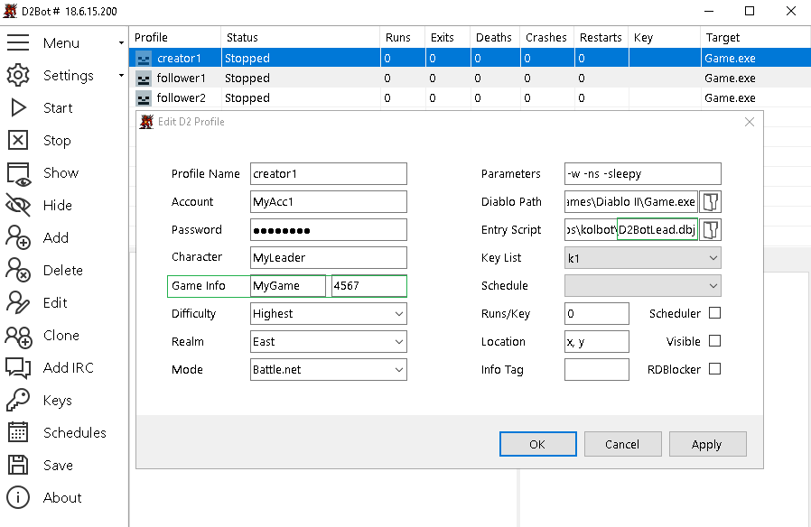

[general table of content](https://github.com/blizzhackers/documentation/#diablo-2-botting-system)

[kolbot table of content](https://github.com/blizzhackers/documentation/tree/master/kolbot/#kolbot)

---

# Multi Botting

---

* [Info](#info)
* [Game Creator](#game-creator)
* [Joining Games](#joining-games)
* [Using Followers](#using-followers)

---

### info
[d2bs](https://github.com/kolton/d2bot-with-kolbot) allows multi-botting.

## game creator
*D2BotLead is the starter script that you will use to create games. It can announce games in channels when used for public runs. You have to set D2BotLead for your profile as a entry script. Now edit starter with notepad++. First part of starter is self-explanatory. 
* the creator of the game doesn't necessarily to be set as the leader in game.

#### create/edit the profile
*you can also use the [D2BotLeadStagger](https://github.com/mf022/d2bs/wiki/Misc_options#staggered-delays-for-creating-games)- a staggered version of D2BotLead



#### randomize the timers
```
var StarterConfig = {
    MinGameTime: rand(150, 180), // Minimum game length in seconds. If a game is ended too soon, the rest of the time is waited in the lobby
    PingQuitDelay: rand(30, 40), // Time in seconds to wait in lobby after quitting due to high ping
    CreateGameDelay: rand(5, 15), // Seconds to wait before creating a new game
    ResetCount: 999, // Reset game count back to 1 every X games.
    CharacterDifference: 99, // Character level difference. Set to false to disable character difference.
    ChatActionsDelay: rand(2, 5), // Seconds to wait in lobby before entering a channel

    // ChannelConfig can override these options for individual profiles.
    JoinChannel: "", // Default channel. Can be an array of channels - ["channel 1", "channel 2"]
    FirstJoinMessage: "", // Default join message. Can be an array of messages
    AnnounceGames: false, // Default value
    AfterGameMessage: "", // Default message after a finished game. Can be an array of messages

    SwitchKeyDelay: rand(5, 15), // Seconds to wait before switching a used/banned key or after realm down
    CrashDelay: rand(60, 120), // Seconds to wait after a d2 window crash
    FTJDelay: rand(20, 30), // Seconds to wait after failing to create a game
    RealmDownDelay: rand(3, 7), // Minutes to wait after getting Realm Down message
    UnableToConnectDelay: rand(5, 10), // Minutes to wait after Unable To Connect message
    CDKeyInUseDelay: rand(5, 10), // Minutes to wait before connecting again if CD-Key is in use.
    ConnectingTimeout: rand(20, 30), // Seconds to wait before cancelling the 'Connecting...' screen
    PleaseWaitTimeout: rand(10, 20), // Seconds to wait before cancelling the 'Please Wait...' screen
    WaitInLineTimeout: rand(60, 90), // Seconds to wait before cancelling the 'Waiting in Line...' screen
    GameDoesNotExistTimeout: rand(30, 40) // Seconds to wait before cancelling the 'Game does not exist.' screen
};
```
* if you don't wanna join a chat channel, you don't have to edit anything more.
* the game creator can be also a manual played char, see [d2bs manual play](https://github.com/documentation/kolbot/ManualPlay.md/#manual-playing) page.

## joining games
[Kolbot Leecher config](https://github.com/kolton/d2bot-with-kolbot/wiki/Kolbot-Leecher-Starter)
There are two different starter scripts for joining games:

* D2BotFollow - based on locally shared info between different profiles of the same d2bs manager

* D2BotChannel - based on info shared on chat channels

### D2BotFollow
* joining chat channel isn't needed.
* the game name & password is shared through d2bs locally.

##### the joiners profiles


##### randomize the timers
replace the default lines 1-17 of [D2BotFollow.dbj](https://github.com/kolton/d2bot-with-kolbot/blob/master/d2bs/kolbot/D2BotFollow.dbj) with these:
```
var StarterConfig = {
    JoinChannel: "", // Name of the channel to join
    FirstJoinMessage: "", // Message to say when first joining a channel, usually ".login"
    ChatActionsDelay: rand(2, 7), // Seconds to wait in lobby before entering a channel

    JoinRetryDelay: rand(5, 15), // Time in seconds to wait before next join attempt
    SwitchKeyDelay: rand(5, 15), // Seconds to wait before switching a used/banned key or after realm down

    CrashDelay: rand(60, 120), // Seconds to wait after a d2 window crash
    RealmDownDelay: rand(3, 5), // Minutes to wait after getting Realm Down message
    UnableToConnectDelay: rand(2, 7), // Minutes to wait after Unable To Connect message
    CDKeyInUseDelay: rand(2, 7), // Minutes to wait before connecting again if CD-Key is in use. SwitchKeys overrides this!
    ConnectingTimeout: rand(20, 30), // Seconds to wait before cancelling the 'Connecting...' screen
    PleaseWaitTimeout: rand(30, 40), // Seconds to wait before cancelling the 'Please Wait...' screen
    WaitInLineTimeout: rand(60, 120), // Seconds to wait before cancelling the 'Waiting in Line...' screen
    GameDoesNotExistTimeout: rand(30, 60) // Seconds to wait before cancelling the 'Game does not exist.' screen
};
```

###### edit the joining info
use np++ to edit D2BotFollow.js and complete the JoinSettings and AdvancedConfig info


### D2BotChannel
* main [guide](https://github.com/kolton/d2bot-with-kolbot/wiki/Kolbot-Leecher-Starter#2-d2botchannel-is-used-to-join-games-from-both-channel-announcements-and-friend-list-announcements-that-means-that-you-can-use-this-starter-when-want-to-join-games-that-are-runned-on-other-computer-in-this-example-we-will-join-channel-kolbot-and-our-first-message-will-be-im-from-other-dimension)
* edit [D2BotChannel.dbj](https://github.com/kolton/d2bot-with-kolbot/blob/master/d2bs/kolbot/D2BotChannel.dbj) with the required settings

## team games
Note: the game creator isn't necessarily to be set as the leader in game.

you have to complete these fields for your leechers/helpers/followers
```
	Config.Leader = "xXxX"; // Leader's ingame character name.
	Config.QuitList = ["xXxX"]; // List of character names to quit with.
```

### using MFTeam
* script allows multiple characters to do the same boss/area runs in sync.
* the leader will open a town portal and give commands to the helpers. Because it uses town portals, it's possible for walking characters to run the same bosses as teleporting characters.
* unfortunately the commands are based on battle.net chat, so the leader key can be muted. To avoid these, check the [local chat](https://github.com/blizzhackers/documentation/kolbot/CharacterConfig.md/#local-chat) section. Choose mode 1, or 2 if you are playing also manually.
```
	LocalChat: {
		Enabled: true,
		Toggle: false,
		Mode: 1
	},
```
* MFHelper will do the area clearing on his own, independent from leader.

#### MFLeader
* in the leader config you have to set
```
    // Team MF system
    Config.MFLeader = true; // Set to true if you have one or more MFHelpers. Opens TP and gives commands when doing normal MF runs.
```
and to enable the scripts you wanna run.

#### MFHelper
* the helper needs to have as the only running script
```
    Scripts.MFHelper = true; // Run the same MF run as the MFLeader.
```
* the MFHelper script will end if the leader enters in Chaos Sanctuary or Throne of Destruction, because it's better to run the related DiabloHelper or BaalHelper after the MFHelper script.

#### silenced MFTeam
check the [local chat](https://github.com/blizzhackers/documentation/blob/master/kolbot/CharacterConfig.md/#local-chat) section.

### using Followers
* see [Follower guide](https://github.com/kolton/d2bot-with-kolbot/wiki/Follower)
* the leader can be played manually - see [d2bs manual play](https://github.com/blizzhackers/documentation/blob/master/kolbot/ManualPlay.md/#manual-playing)
* you should use the [local chat](https://github.com/blizzhackers/documentation/blob/master/kolbot/CharacterConfig.md/#local-chat) with the settings
```
	LocalChat: {
		Enabled: true,
		Toggle: false,
		Mode: 2
	},
```
* the other helping characters need this
```
    Scripts.Follower = true; // Script that follows a manually played leader around like a merc. For a list of commands, see Follower.js
```
* Follower.js is using chat commands like: 1, 2, wp, bo, ...
* for a modded silenced follower, see [silenced Follower](https://github.com/mf022/d2bs/wiki/Misc_options#silenced-follower)

### dia-baal teams
* leader and leechers can have other scripts activated before Diablo, or Baal, in the same areas using MFTeam, or separated areas on their own.
* order for the scripts is top to bottom in character configuration file. To facilitate the meeting on the same time you can cut and paste the scripts, mixing the default order to get that scope.
* leader will run the main scripts Diablo.js and Baal.js
* leecher will have DiabloHelper and BaalHelper activated (true).