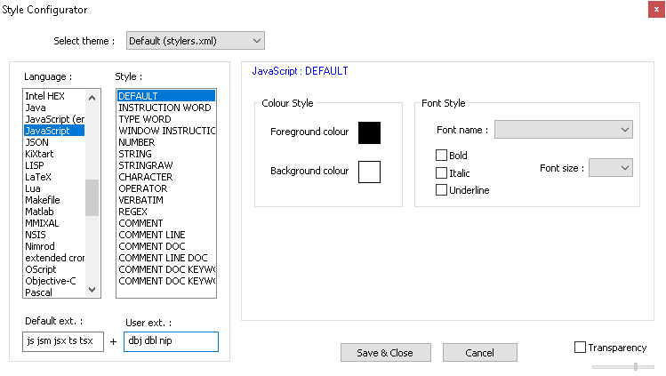

[general table of content](https://github.com/blizzhackers/documentation/#diablo-2-botting-system)

[kolbot table of content](https://github.com/blizzhackers/documentation/tree/master/kolbot/#kolbot)

---

## Syntax highlighting in np++

Kolbot scripts are written in Javascript language. **.js** files are automatically highlighted for easier editing in [Notepad++](https://notepad-plus-plus.org/downloads/).
Specific kolbot .dbj and .dbl files have to be added to javascript style

* press **Settings** in Notepad++ toolbar and select **Style Configurator...**

* find Javascript in Language column

* add **dbl dbj nip** in User ext. field

* press **Save & Close** button

* restart Notepad++

