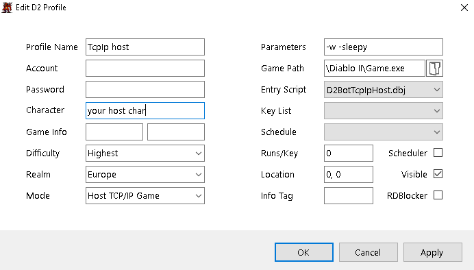
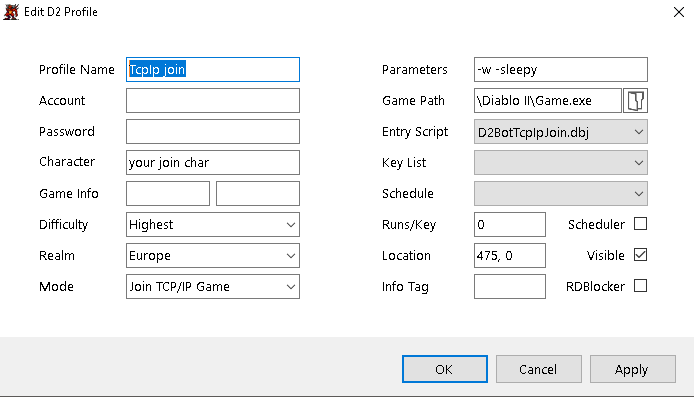

[general table of content](https://github.com/blizzhackers/documentation/#diablo-2-botting-system)

[kolbot table of content](https://github.com/blizzhackers/documentation/tree/master/kolbot/#kolbot)

---

# TCP/IP games

---

* [Info](#info)
* [Host config](#host-config)
* [Join config](#join-config)

---

## info

* [d2bs](https://github.com/kolton/d2bot-with-kolbot) allows botting in TCP/IP created games

## Host config

1. save https://pastebin.com/FGaMpj18 as D2BotTcpIpHost.dbj in your ...\kolbot folder

1. create and edit a new profile in your D2Bot manager, using the previous created starter script:

## Join config

1. save https://pastebin.com/zQyUrDKP as D2BotTcpIpJoin.dbj in your ...\kolbot folder

1. create and edit a new profile in your D2Bot manager, using the previous created starter script:

