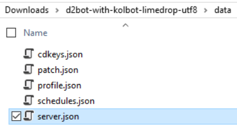
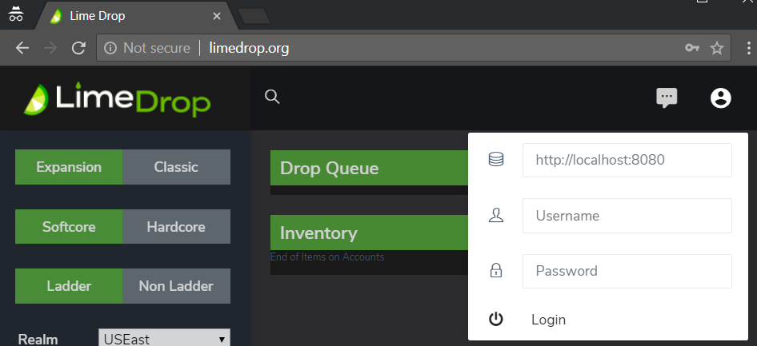

# LimeDrop Guide

* [About](#about-limedrop)
* [Setup](#setup-limedrop)
* [Usage](#using-limedrop)
* [FAQ](#frequently-asked-questions)

-----

### About LimeDrop
##### What is it?
LimeDrop is a  **dropper**; it is a program that will manage joining games and dropping specific items.

##### How do I install it?
LimeDrop is an addon to the existing D2BS application. The branch [limedrop-utf8](https://github.com/kolton/d2bot-with-kolbot/tree/limedrop-utf8) contains the regular D2BS with Kolbot, and also LimeDrop.

##### How does it work?
There are two parts to LimeDrop. One part is the API, and one part is a web page that calls the API. By default, only the API comes with the limedrop-utf8 version of D2BS.

When the web page requests an item, LimeDrop will launch the configured profile, join the game configured, and drop the item(s) selected.

##### Self-hosting
For the web page you can download it [here](https://github.com/noah-/limedrop) and copy it to the "limedrop" folder of your D2BS folder.

If you're using Git to clone D2BS with Kolbot it will ask you if you want to automatically download the sub-repository.

##### Externally Hosted
You can also use the externally hosted version here: [http://www.limedrop.org](http://www.limedrop.org)

The benefit of this version is that it is always up-to-date

**Note:** If you want to access LimeDrop externally you will need to open router ports. This is not recommended at this time because LimeDrop is still in the Alpha stage.

### Setup LimeDrop
1. Download the LimeDrop version of D2BS from [here](https://github.com/kolton/d2bot-with-kolbot/archive/limedrop-utf8.zip) or clone from: _https://github.com/kolton/d2bot-with-kolbot.git_

1. Extract to a folder:
	

1. Follow the usual D2BS setup of adding in your keys

1. Create a new profile, we will use GameAction for an example
	* Make sure you set your own game name to avoid conflicts with other people
		* 
    * Make sure you use the D2BotGameAction.dbj as the Entry Script

1. Edit the server.config file:
	* 
	* 
	* This default config says to:
		* Use the D2BS profile called "GameAction"
		* Create a user with the name "public", password "public" who **is not** able to drop items
		* Create a user with the name "test", password "test" who **is** able to drop items
		* The path to the web page files are in the "\limedrop" folder underneath the D2BS directory
		* The IP we will respond on is "localhost" (also known as 127.0.0.1)
			* If you want to access from another computer, you will need to use your real local IP like 192.168.1.100
        * The Port we will listen on is 8080

1. LimeDrop is disabled by default on newer releases. Make sure you go to "Settings" and enable the API.
		
### Using LimeDrop
To start LimeDrop, just open D2BS.exe . You DO NOT have to launch the profile manually.
LimeDrop will launch the profile on its own when it needs to do something.

#### Logging In
* To login, either go to your self-hosted web page, or to [http://www.limedrop.org](http://www.limedrop.org)
* At the upper right, click the profile icon to log in:
	* 
	* Enter your server address (including port) according to your server config
	* Enter your username
	* Enter your password
	* **Click Login**
		* Right now you have to manually click Login. You cannot just press enter.

#### Muling Options
* You can create a profile using the standard MuleLogger profile
	* All mules logged this way will appear in the LimeDrop web page

* You can use the Web Interface to manually add a whole profile, or a single character:
	* 
	* 

  A - Select the realm for the account

	B - Diablo Account

	C - Diablo Account password

	D - Type specific character names, or leave it empty to log all

	E - Click "Add Row" if you want to add more than one account at a time

	F - LimeDrop account password

	G - Click to begin logging accounts

**Note:** It is safe to log the same account by "adding" it through this interface. It will just update the files.

**Note:** Currently you _can not_ use Numpad 5 to manually log a character with LimeDrop

#### Emergency Stop
You may notice that if you "stop" the GameAction profile that it immediately starts up again.

If you need to force the profile to stop you need to open the profile and erase the "tag" information. 

* Edit Profile
* Erase information in Tag
* Click Apply
* Stop the profile

**Note:** If you have queued many drops, you will need to clear it for each drop, or you will need to restart D2BSharp.

### Frequently Asked Questions
#### Will LimeDrop steal my information?
No. The web page part of LimeDrop only makes calls to the API running on your D2BS. Your account passwords are not stored directly in the web page. Also, it's open source so if you don't trust it you can always take a look at the code yourself!

#### Can it run side-by-side with my existing bots?
Yes. If you want to quickly try LimeDrop you can copy it to a separate folder and configure it

#### Can I use my existing mule logs with LimeDrop?
No. You will have to re-scan your existing mules in order to add them to the LimeDrop Inventory

#### Will LimeDrop automatically update my inventory after dropping items?
Yes.
